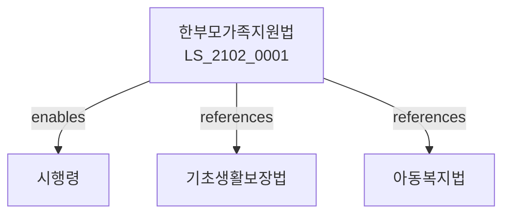

# 한부모가족지원법

> [법률 제20162호, 2024. 1. 9., 일부개정]

---

---

## 제1장 총칙
### 제1조 (목적)
이 법은 한부모가족의 생활안정과 복지증진을 도모함을 목적으로 한다。

### 제2조 (정의)
이 법에서 사용하는 용어의 뜻은 다음과 같다。

1. "한부모가족"이란 편부 또는 편모와 자녀로 구성된 가족을 말한다。
2. "편부"란 배우자 없이 자녀를 양육하는 아버지를 말한다。
3. "편모"란 배우자 없이 자녀를 양육하는 어머니를 말한다。
4. "자녀"란 18세 미만의 자를 말한다。

---

## 제2장 한부모가족지원
### 第5条(지원대상)
한부모가족지원대상을 정한다。
### 第6条(조사)
한부모가족조사를 실시한다。
### 第7条(등록)
한부모가족등록을 한다。
### 第8条(지원결정)
지원여부를 결정한다。

---

## 제3장 생활지원
### 第15条(생활지원)
생활지원을 실시한다。
### 第16条(생활비)
생활비를 지급할 수 있다。
### 第17条(양육비)
양육비를 지원할 수 있다。
### 第18条(주거지원)
주거지원을 실시할 수 있다。

---

## 제4장 교육지원
### 第25条(교육지원)
교육지원을 실시한다。
### 第26条(학비지원)
학비를 지원할 수 있다。
### 第27条(보육지원)
보육을 지원한다。
### 第28条(교육비보조)
교육비를 보조할 수 있다。

---

## 제5장 고용지원
### 第35条(고용지원)
고용지원을 실시한다。
### 第36条(직업훈련)
직업훈련을 지원한다。
### 第37条(취업알선)
취업알선을 실시한다。
### 第38条(자립지원)
자립을 지원한다。

---

## 제6장 시설
### 第42条(시설)
한부모가족시설을 설치할 수 있다。
### 第43条(모자보호시설)
모자보호시설을 설치할 수 있다。
### 第44条(시설운영)
시설운영기준을 정한다。
### 第45条(시설입소)
시설입소를 실시한다。

---

## 제7장 감독
### 第52条(감독)
보건복지부장관은 한부모가족지원사업을 감독한다。
### 第53条(보고 및 검사)
필요한 경우 보고를 명하거나 검사할 수 있다。
### 第54条(시정명령)
위법한 사항에 대하여는 시정을 명할 수 있다。
### 第55条(지원중단)
중대한 위반사유가 있는 경우 지원을 중단할 수 있다。

---

## 제8장 벌칙
### 第62条(과태료)
다음 각 호의 어느 하나에 해당하는 자에게는 1천만원 이하의 과태료를 부과한다。

1. 보고를 하지 아니한 자
2. 검사를 거부한 자

---

## 관계 그래프

**상위 법령**
- [[헌법]] 제36조 (혼인가족제도)
- [[기초생활보장법]]

**관련 법령**
- [[아동복지법]]
- [[영유아보육법]]
- [[고용보험법]]
- [[주택법]]

**하위 법령**
- [[한부모가족지원법 시행령]]
