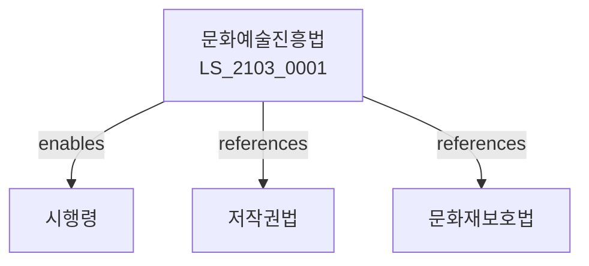

# 문화예술진흥법

> [법률 제20163호, 2024. 1. 9., 일부개정]

---

---

## 제1장 총칙
### 제1조 (목적)
이 법은 문화예술의 진흥을 도모함으로써 국민의 문화향수 기회를 확대하고 국민경제의 발전에 이바지함을 목적으로 한다。

### 제2조 (정의)
이 법에서 사용하는 용어의 뜻은 다음과 같다。

1. "문화예술"이란 문학ㆍ미술ㆍ음악ㆍ무용ㆍ연극ㆍ영화 등 예술적 활동을 말한다。
2. "문화예술인"이란 문화예술 활동을 직업으로 하는 자를 말한다。
3. "문화시설"이란 문화예술 활동을 위한 시설을 말한다。
4. "문화사업"이란 문화예술 진흥을 위한 사업을 말한다。

---

## 제2장 문화예술진흥정책
### 第5条(기본계획)
문화예술진흥기본계획을 수립한다。
### 第6条(시행계획)
문화예술진흥시행계획을 수립한다。
### 第7条(평가)
문화예술진흥정책을 평가한다。
### 第8条(조정)
문화예술진흥정책을 조정한다。

---

## 제3장 문화예술인 지원
### 第15条(창작지원)
문화예술인의 창작활동을 지원한다。
### 第16条(활동지원)
문화예술인의 활동을 지원한다。
### 第17条(복지지원)
문화예술인의 복지를 지원한다。
### 第18条(연금지원)
문화예술인 연금을 지원할 수 있다。

---

## 제4장 문화시설
### 第25条(문화시설)
문화시설을 확충한다。
### 第26条(문화회관)
문화회관을 설치할 수 있다。
### 第27条(미술관)
미술관을 설치할 수 있다。
### 第28条(박물관)
박물관을 설치할 수 있다。

---

## 제5장 문화사업
### 第35条(문화사업)
문화사업을 추진한다。
### 第36条(문화축제)
문화축제를 지원할 수 있다。
### 第37条(문화교류)
문화교류사업을 추진한다。
### 第38条(국제협력)
문화분야 국제협력을 추진한다。

---

## 제6장 문화산업
### 第42条(문화산업)
문화산업을 육성한다。
### 第43条(콘텐츠산업)
콘텐츠산업을 육성한다。
### 第44条(문화기술)
문화기술을 개발한다。
### 第45条(문화수출)
문화수출을 지원한다。

---

## 제7장 감독
### 第52条(감독)
문화체육관광부장관은 문화예술진흥사업을 감독한다。
### 第53条(보고 및 검사)
필요한 경우 보고를 명하거나 검사할 수 있다。
### 第54条(시정명령)
위법한 사항에 대하여는 시정을 명할 수 있다。
### 第55条(지원중단)
중대한 위반사유가 있는 경우 지원을 중단할 수 있다。

---

## 제8장 벌칙
### 第62条(과태료)
다음 각 호의 어느 하나에 해당하는 자에게는 2천만원 이하의 과태료를 부과한다。

1. 보고를 하지 아니한 자
2. 검사를 거부한 자

---

## 관계 그래프

**상위 법령**
- [[헌법]] 제22조 (학문예술의자유)
- [[문화재보호법]]

**관련 법령**
- [[저작권법]]
- [[영화진흥법]]
- [[방송법]]
- [[콘텐츠산업진흥법]]

**하위 법령**
- [[문화예술진흥법 시행령]]
