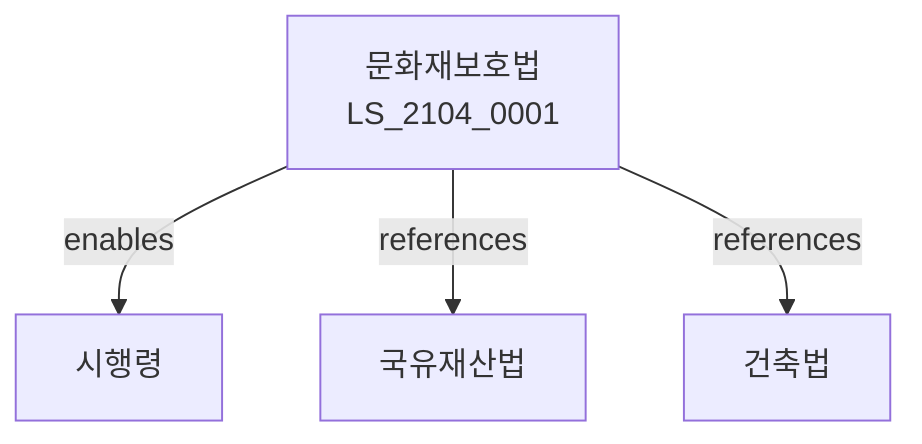

# 문화재보호법

> [법률 제20164호, 2024. 1. 9., 일부개정]

---

---

## 제1장 총칙
### 제1조 (목적)
이 법은 문화재를 보존ㆍ관리하고 국민의 문화향수 기회를 확대함을 목적으로 한다。

### 제2조 (정의)
이 법에서 사용하는 용어의 뜻은 다음과 같다。

1. "문화재"란 역사ㆍ예술적 가치가 있는 유형ㆍ무형의 유산을 말한다。
2. "지정문화재"란 국가 또는 지자체가 지정한 문화재를 말한다。
3. "등록문화재"란 등록된 문화재를 말한다。
4. "매장문화재"란 땅속에 매장된 문화재를 말한다。

---

## 제2장 지정문화재
### 第5条(지정)
국가지정문화재를 지정한다。
### 第6条(보물)
보물을 지정할 수 있다。
### 第7条(국보)
국보를 지정할 수 있다。
### 第8条(사적)
사적을 지정할 수 있다。

---

## 제3장 문화재관리
### 第15条(관리)
지정문화재를 관리한다。
### 第16条(관리단체)
관리단체를 지정할 수 있다。
### 第17条(관리비)
관리비를 지원할 수 있다。
### 第18条(관리기준)
관리기준을 정한다。

---

## 제4장 문화재보존
### 第25条(보존)
문화재를 보존한다。
### 第26条(수리)
문화재를 수리한다。
### 第27条(보존조치)
보존을 위한 조치를 한다。
### 第28条(보존지구)
문화재보존지구를 지정할 수 있다。

---

## 제5장 매장문화재
### 第35条(매장문화재)
매장문화재를 관리한다。
### 第36条(발굴)
매장문화재를 발굴할 수 있다。
### 第37条(발굴허가)
발굴은 허가를 받아야 한다。
### 第38条(발굴보고)
발굴결과를 보고하여야 한다。

---

## 제6장 무형문화재
### 第42条(무형문화재)
무형문화재를 지정한다。
### 第43条(보유자)
무형문화재 보유자를 인정한다。
### 第44条(전수교육)
무형문화재 전수교육을 실시한다。
### 第45条(지원)
무형문화재 보유자를 지원한다。

---

## 제7장 감독
### 第52条(감독)
문화재청장은 문화재보호사업을 감독한다。
### 第53条(보고 및 검사)
필요한 경우 보고를 명하거나 검사할 수 있다。
### 第54条(시정명령)
위법한 사항에 대하여는 시정을 명할 수 있다。
### 第55条(지정취소)
중대한 위반사유가 있는 경우 지정을 취소할 수 있다。

---

## 제8장 벌칙
### 第62条(벌칙)
다음 각 호의 어느 하나에 해당하는 자는 5년 이하의 징역 또는 5천만원 이하의 벌금에 처한다.

1. 문화재를 훼손한 자
2. 허가 없이 발굴한 자
### 第63条(과태료)
다음 각 호의 어느 하나에 해당하는 자에게는 3천만원 이하의 과태료를 부과한다.

1. 보고를 하지 아니한 자
2. 검사를 거부한 자

---

## 관계 그래프

**상위 법령**
- [[헌법]] 제22조 (학문예술의자유)
- [[국유재산법]]

**관련 법령**
- [[건축법]]
- [[국토계획법]]
- [[박물관및미술관진흥법]]
- [[매장문화재보호법]]

**하위 법령**
- [[문화재보호법 시행령]]
