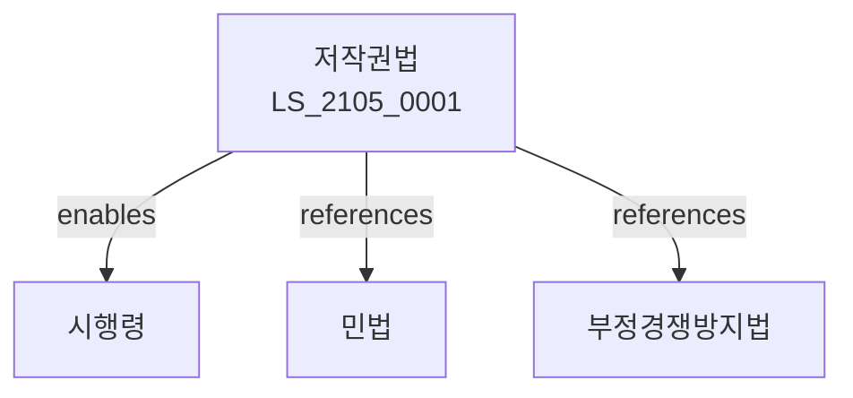

# 저작권법

> [법률 제20165호, 2024. 1. 9., 일부개정]

---

---

## 제1장 총칙
### 제1조 (목적)
이 법은 저작자의 권리와 이에 인접하는 권리를 보호함으로써 문화의 향상과 발전에 이바지함을 목적으로 한다。

### 제2조 (정의)
이 법에서 사용하는 용어의 뜻은 다음과 같다。

1. "저작물"이란 문학ㆍ학술 또는 예술범위에서 창작물을 말한다。
2. "저작자"란 저작물을 창작한 자를 말한다。
3. "저작권"이란 저작재산권과 저작인격권을 말한다。
4. "저작인접권"이란 실연권ㆍ음반제작권ㆍ방송권을 말한다。

---

## 제2장 저작물
### 第5条(저작물)
저작물의 범위를 정한다。
### 第6条(어문저작물)
어문저작물을 보호한다。
### 第7条(음악저작물)
음악저작물을 보호한다。
### 第8条(미술저작물)
미술저작물을 보호한다。

---

## 제3장 저작자
### 第15条(저작자)
저작자의 권리를 보호한다。
### 第16条(창작)
저작물의 창작을 인정한다。
### 第17条(공저작자)
공저작자의 권리를 정한다。
### 第18条(직무저작물)
직무저작물의 권리를 정한다。

---

## 제4장 저작재산권
### 第25条(저작재산권)
저작재산권을 보호한다。
### 第26条(복제권)
복제권을 보호한다。
### 第27条(배포권)
배포권을 보호한다。
### 第28条(공연권)
공연권을 보호한다。

---

## 제5장 저작인격권
### 第35条(저작인격권)
저작인격권을 보호한다。
### 第36条(공표권)
공표권을 보호한다。
### 第37条(성명표시권)
성명표시권을 보호한다。
### 第38条(동일성유지권)
동일성유지권을 보호한다。

---

## 제6장 저작인접권
### 第42条(실연권)
실연자의 권리를 보호한다。
### 第43条(음반제작권)
음반제작자의 권리를 보호한다。
### 第44条(방송권)
방송사업자의 권리를 보호한다。
### 第45条(보호기간)
저작인접권의 보호기간을 정한다。

---

## 제7장 권리의 제한
### 第52条(공정이용)
공정이용을 인정한다。
### 第53条(교육목적)
교육목적 이용을 인정한다。
### 第54条(보도목적)
보도목적 이용을 인정한다。
### 第55条(사적이용)
사적이용을 인정한다。

---

## 제8장 저작권위탁관리
### 第62条(저작권위탁관리업)
저작권위탁관리업을 등록한다。
### 第63条(등록요건)
등록요건을 정한다。
### 第64条(영업기준)
영업기준을 준수한다。
### 第65条(감독)
저작권위탁관리업을 감독한다。

---

## 제9장 벌칙
### 第72条(벌칙)
다음 각 호의 어느 하나에 해당하는 자는 5년 이하의 징역 또는 5천만원 이하의 벌금에 처한다.

1. 저작권을 침해한 자
2. 저작인접권을 침해한 자
### 第73条(과태료)
다음 각 호의 어느 하나에 해당하는 자에게는 3천만원 이하의 과태료를 부과한다.

1. 보고를 하지 아니한 자
2. 검사를 거부한 자

---

## 관계 그래프

**상위 법령**
- [[헌법]] 제22조 (학문예술의자유)
- [[민법]]

**관련 법령**
- [[부정경쟁방지법]]
- [[특허법]]
- [[상표법]]
- [[컴퓨터프로그램보호법]]

**하위 법령**
- [[저작권법 시행령]]
