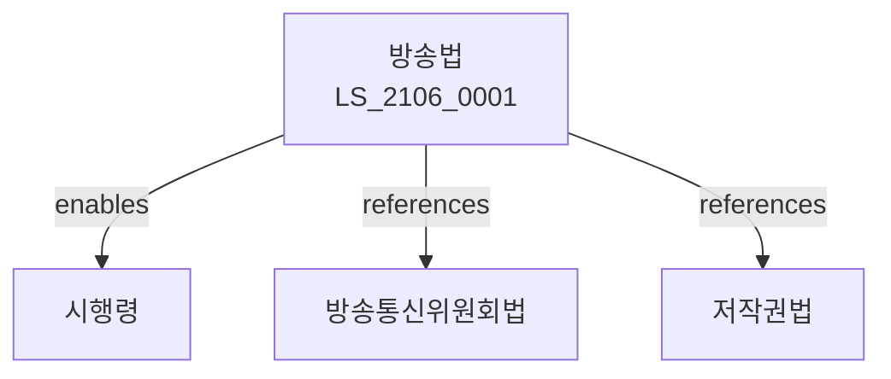

# 방송법

> [법률 제20166호, 2024. 1. 9., 일부개정]

---

---

## 제1장 총칙
### 제1조 (목적)
이 법은 방송의 건전한 발전과 공익성을 확보함으로써 민주주의와 국민문화의 향상에 이바지함을 목적으로 한다。

### 제2조 (정의)
이 법에서 사용하는 용어의 뜻은 다음과 같다。

1. "방송"이란 공중에게 전파하는 방송프로그램을 말한다。
2. "방송사업자"란 방송을 행하는 자를 말한다。
3. "방송프로그램"이란 방송의 내용이 되는 것을 말한다。
4. "수신자"란 방송을 수신하는 자를 말한다。

---

## 제2장 방송정책
### 第5条(방송정책)
방송정책을 수립한다。
### 第6条(방송진흥)
방송진흥계획을 수립한다。
### 第7条(방송평가)
방송을 평가한다。
### 第8条(방송조정)
방송정책을 조정한다。

---

## 제3장 방송사업
### 第15条(방송사업)
방송사업은 등록 또는 허가를 받아야 한다。
### 第16条(지상파방송)
지상파방송사업은 허가를 받아야 한다。
### 第17条(종합유선방송)
종합유선방송사업은 등록하여야 한다。
### 第18条(위성방송)
위성방송사업은 등록하여야 한다。

---

## 제4장 방송프로그램
### 第25条(프로그램)
방송프로그램의 기준을 정한다。
### 第26条(편성)
방송프로그램 편성기준을 정한다。
### 第27条(국내제작)
국내제작프로그램 비율을 정한다。
### 第28条(등급분류)
방송프로그램 등급분류를 실시한다。

---

## 제5장 방송광고
### 第35条(방송광고)
방송광고를 규제한다。
### 第36条(광고시간)
광고시간을 제한할 수 있다。
### 第37条(광고내용)
광고내용을 심의한다。
### 第38条(광고판매)
광고판매를 규제한다。

---

## 제6장 방송심의
### 第42条(방송심의)
방송내용을 심의한다。
### 第43条(심의기구)
방송심의기구를 둔다。
### 第44条(심의기준)
심의기준을 정한다。
### 第45条(심의결과)
심의결과를 공표한다。

---

## 제7장 감독
### 第52条(감독)
과학기술정보통신부장관은 방송사업을 감독한다。
### 第53条(보고 및 검사)
필요한 경우 보고를 명하거나 검사할 수 있다。
### 第54条(시정명령)
위법한 사항에 대하여는 시정을 명할 수 있다。
### 第55条(허가취소)
중대한 위반사유가 있는 경우 허가를 취소할 수 있다。

---

## 제8장 벌칙
### 第62条(벌칙)
다음 각 호의 어느 하나에 해당하는 자는 3년 이하의 징역 또는 5천만원 이하의 벌금에 처한다.

1. 허가 없이 방송사업을 영위한 자
2. 방송내용을 위조한 자
### 第63条(과태료)
다음 각 호의 어느 하나에 해당하는 자에게는 3천만원 이하의 과태료를 부과한다.

1. 보고를 하지 아니한 자
2. 검사를 거부한 자

---

## 관계 그래프

**상위 법령**
- [[헌법]] 제21조 (언론출판의자유)
- [[방송통신위원회법]]

**관련 법령**
- [[저작권법]]
- [[정보통신망법]]
- [[방송광고법]]
- [[인터넷멀티미디어방송사업법]]

**하위 법령**
- [[방송법 시행령]]
