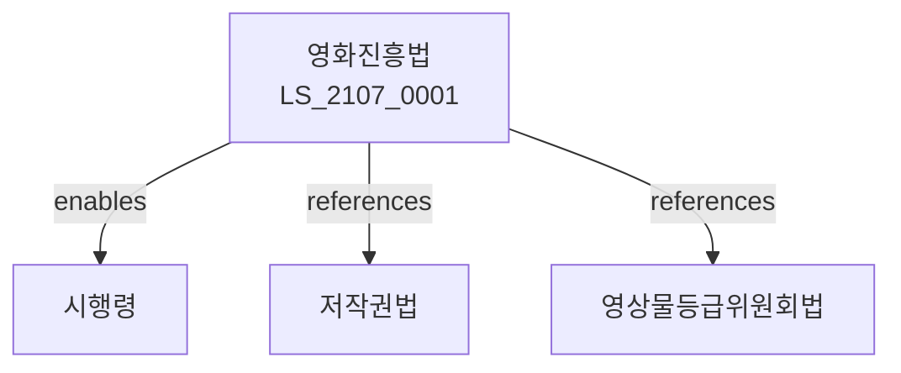

# 영화 및 비디오물의 진흥에 관한 법률

> [법률 제20167호, 2024. 1. 9., 일부개정]

---

---

## 제1장 총칙
### 제1조 (목적)
이 법은 영화 및 비디오물의 진흥을 도모하고 국민의 문화향수 기회를 확대함을 목적으로 한다。

### 제2조 (정의)
이 법에서 사용하는 용어의 뜻은 다음과 같다。

1. "영화"란 영화제작을 위하여 촬영된 필름 또는 디지털영상을 말한다。
2. "비디오물"이란 영상과 음성을 기록한 매체를 말한다。
3. "영화사업"이란 영화의 제작ㆍ배급ㆍ상영사업을 말한다。
4. "등급분류"란 영화 및 비디오물의 등급을 정하는 것을 말한다。

---

## 제2장 영화진흥정책
### 第5条(기본계획)
영화진흥기본계획을 수립한다。
### 第6条(시행계획)
영화진흥시행계획을 수립한다。
### 第7条(평가)
영화진흥정책을 평가한다。
### 第8条(조정)
영화진흥정책을 조정한다。

---

## 제3장 영화제작
### 第15条(영화제작)
영화제작을 지원한다。
### 第16条(독립영화)
독립영화를 지원한다。
### 第17条(예술영화)
예술영화를 지원한다。
### 第18条(영화제작지원)
영화제작에 자금을 지원할 수 있다.

---

## 제4장 영화배급
### 第25条(영화배급)
영화배급을 진흥한다。
### 第26条(배급구조)
배급구조를 개선한다。
### 第27条(해외배급)
해외배급을 지원한다。
### 第28条(배급공정)
배급공정을 확보한다.

---

## 제5장 영화상영
### 第35条(영화상영)
영화상영을 진흥한다。
### 第36条(영화관)
영화관을 설치할 수 있다。
### 第37条(상영기준)
상영기준을 정한다。
### 第38条(스크린쿼터)
국내영화 상영의무를 정한다。

---

## 제6장 등급분류
### 第42条(등급분류)
영화의 등급을 분류한다。
### 第43条(등급기준)
등급분류기준을 정한다。
### 第44条(등급위원회)
영상물등급위원회를 둔다。
### 第45条(심의)
등급분류 심의를 실시한다.

---

## 제7장 감독
### 第52条(감독)
문화체육관광부장관은 영화진흥사업을 감독한다。
### 第53条(보고 및 검사)
필요한 경우 보고를 명하거나 검사할 수 있다。
### 第54条(시정명령)
위법한 사항에 대하여는 시정을 명할 수 있다。
### 第55条(등록취소)
중대한 위반사유가 있는 경우 등록을 취소할 수 있다.

---

## 제8장 벌칙
### 第62条(벌칙)
다음 각 호의 어느 하나에 해당하는 자는 3년 이하의 징역 또는 3천만원 이하의 벌금에 처한다.

1. 등급분류 없이 영화를 상영한 자
2. 허위로 등록한 자
### 第63条(과태료)
다음 각 호의 어느 하나에 해당하는 자에게는 2천만원 이하의 과태료를 부과한다.

1. 보고를 하지 아니한 자
2. 검사를 거부한 자

---

## 관계 그래프

**상위 법령**
- [[헌법]] 제22조 (학문예술의자유)
- [[저작권법]]

**관련 법령**
- [[영상물등급위원회법]]
- [[방송법]]
- [[문화예술진흥법]]
- [[콘텐츠산업진흥법]]

**하위 법령**
- [[영화진흥법 시행령]]
