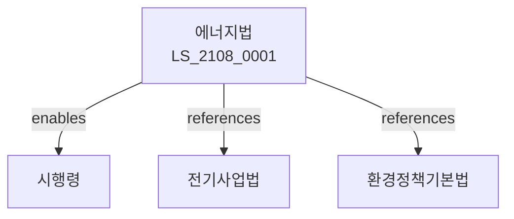

# 에너지이용합리화법

> [법률 제20168호, 2024. 1. 9., 일부개정]

---

---

## 제1장 총칙
### 제1조 (목적)
이 법은 에너지의 합리적 이용을 도모함으로써 국민경제의 건전한 발전에 이바지함을 목적으로 한다。

### 제2조 (정의)
이 법에서 사용하는 용어의 뜻은 다음과 같다。

1. "에너지"란 전기ㆍ가스ㆍ석유 등 열과 동력을 발생하는 것을 말한다。
2. "에너지이용합리화"란 에너지의 절약과 효율적 이용을 말한다。
3. "에너지사용자"란 에너지를 사용하는 자를 말한다。
4. "에너지관리사업자"란 에너지관리사업을 하는 자를 말한다.

---

## 제2장 에너지정책
### 第5条(기본계획)
에너지이용합리화기본계획을 수립한다。
### 第6条(시행계획)
에너지이용합리화시행계획을 수립한다。
### 第7条(평가)
에너지정책을 평가한다。
### 第8条(조정)
에너지정책을 조정한다.

---

## 제3장 에너지절약
### 第15条(에너지절약)
에너지절약을 추진한다。
### 第16条(에너지진단)
에너지사용자는 에너지진단을 받을 수 있다。
### 第17条(절약목표)
에너지절약목표를 설정한다。
### 第18条(절약조치)
에너지절약조치를 실시한다。

---

## 제4장 에너지효율
### 第25条(에너지효율)
에너지효율을 제고한다。
### 第26条(효율기준)
에너지효율기준을 정한다。
### 第27条(등급표시)
에너지효율등급을 표시한다。
### 第28条(고효율기자재)
고효율기자재를 보급한다。

---

## 제5장 에너지관리
### 第35条(에너지관리)
에너지관리사업을 실시한다。
### 第36条(관리사업자)
에너지관리사업자를 지정한다。
### 第37条(관리기준)
에너지관리기준을 정한다。
### 第38条(관리지원)
에너지관리를 지원한다。

---

## 제6장 에너지시설
### 第42条(에너지시설)
에너지시설을 확충한다。
### 第43条(열병합발전)
열병합발전을 보급한다。
### 第44条(지역난방)
지역난방사업을 실시한다。
### 第45条(에너지저장)
에너지저장시설을 확충한다。

---

## 제7장 감독
### 第52条(감독)
산업통상자원부장관은 에너지사업을 감독한다。
### 第53条(보고 및 검사)
필요한 경우 보고를 명하거나 검사할 수 있다。
### 第54条(시정명령)
위법한 사항에 대하여는 시정을 명할 수 있다。
### 第55条(조치명령)
에너지절약을 위한 조치를 명할 수 있다。

---

## 제8장 벌칙
### 第62条(과태료)
다음 각 호의 어느 하나에 해당하는 자에게는 3천만원 이하의 과태료를 부과한다.

1. 보고를 하지 아니한 자
2. 검사를 거부한 자

---

## 관계 그래프

**상위 법령**
- [[헌법]] 제119조 (경제자유)
- [[환경정책기본법]]

**관련 법령**
- [[전기사업법]]
- [[가스사업법]]
- [[석유사업법]]
- [[기후변화대응법]]

**하위 법령**
- [[에너지이용합리화법 시행령]]
