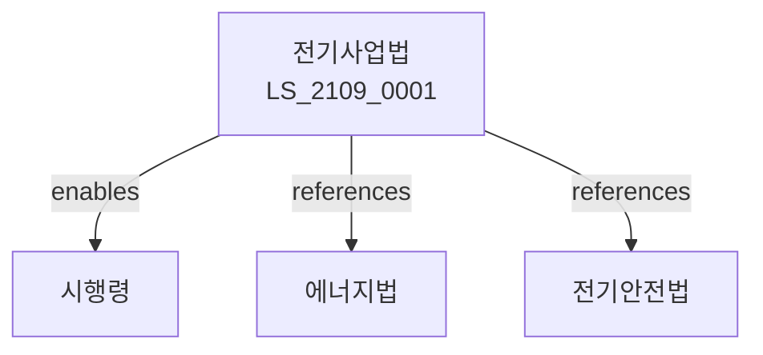

# 전기사업법

> [법률 제20169호, 2024. 1. 9., 일부개정]

---

---

## 제1장 총칙
### 제1조 (목적)
이 법은 전기사업의 건전한 발전을 도모하고 전기의 안정적 공급에 이바지함을 목적으로 한다。

### 제2조 (정의)
이 법에서 사용하는 용어의 뜻은 다음과 같다。

1. "전기사업"이란 전기를 발전ㆍ송전ㆍ배전ㆍ판매하는 사업을 말한다。
2. "전기사업자"란 전기사업을 영위하는 자를 말한다。
3. "전기설비"란 전기를 발생ㆍ송전ㆍ배전하기 위한 설비를 말한다。
4. "전기요금"이란 전기의 대가로 지급하는 요금을 말한다.

---

## 제2장 전기사업
### 第5条(발전사업)
발전사업은 허가를 받아야 한다。
### 第6条(송전사업)
송전사업은 허가를 받아야 한다。
### 第7条(배전사업)
배전사업은 허가를 받아야 한다。
### 第8条(판매사업)
판매사업은 등록하여야 한다。

---

## 제3장 전기설비
### 第15条(전기설비)
전기설비는 기준에 적합하여야 한다。
### 第16条(설비검사)
전기설비는 검사를 받아야 한다。
### 第17条(안전관리)
전기설비의 안전을 관리한다。
### 第18条(유지보수)
전기설비를 유지보수한다。

---

## 제4장 전기요금
### 第25条(요금규제)
전기요금은 인가를 받아야 한다。
### 第26条(요금산정)
전기요금 산정기준을 정한다。
### 第27条(요금체계)
전기요금 체계를 정한다。
### 第28条(요금공시)
전기요금을 공시한다。

---

## 제5장 전력거래
### 第35条(전력거래)
전력거래소를 둔다。
### 第36条(거래규정)
전력거래규정을 정한다。
### 第37条(거래참가)
전력거래에 참가할 수 있다。
### 第38条(거래공정)
전력거래의 공정을 확보한다。

---

## 제6장 전기안전
### 第42条(전기안전)
전기재해를 예방한다。
### 第43条(안전점검)
전기설비 안전점검을 실시한다。
### 第44条(안전교육)
전기안전교육을 실시한다。
### 第45条(안전기준)
전기안전기준을 정한다。

---

## 제7장 감독
### 第52条(감독)
산업통상자원부장관은 전기사업을 감독한다。
### 第53条(보고 및 검사)
필요한 경우 보고를 명하거나 검사할 수 있다。
### 第54条(시정명령)
위법한 사항에 대하여는 시정을 명할 수 있다。
### 第55条(허가취소)
중대한 위반사유가 있는 경우 허가를 취소할 수 있다。

---

## 제8장 벌칙
### 第62条(벌칙)
다음 각 호의 어느 하나에 해당하는 자는 3년 이하의 징역 또는 3천만원 이하의 벌금에 처한다。

1. 허가 없이 전기사업을 영위한 자
2. 전기요금을 부당하게 징수한 자
### 第63条(과태료)
다음 각 호의 어느 하나에 해당하는 자에게는 2천만원 이하의 과태료를 부과한다。

1. 보고를 하지 아니한 자
2. 검사를 거부한 자

---

## 관계 그래프

**상위 법령**
- [[헌법]] 제119조 (경제자유)
- [[에너지이용합리화법]]

**관련 법령**
- [[전기안전법]]
- [[전력산업기반조성법]]
- [[원자력안전법]]
- [[신재생에너지법]]

**하위 법령**
- [[전기사업법 시행령]]
