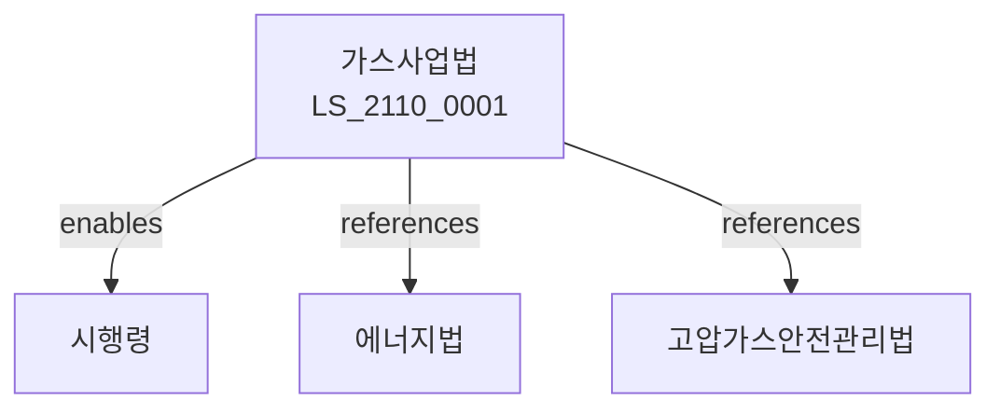

# 가스사업법

> [법률 제20170호, 2024. 1. 9., 일부개정]

---

---

## 제1장 총칙
### 제1조 (목적)
이 법은 가스사업의 건전한 발전을 도모하고 가스의 안정적 공급에 이바지함을 목적으로 한다。

### 제2조 (정의)
이 법에서 사용하는 용어의 뜻은 다음과 같다。

1. "가스"란 천연가스ㆍ액화석유가스 등 연료용 가스를 말한다。
2. "가스사업"이란 가스를 제조ㆍ공급하는 사업을 말한다。
3. "가스사업자"란 가스사업을 영위하는 자를 말한다。
4. "가스설비"란 가스를 제조ㆍ공급하기 위한 설비를 말한다.

---

## 제2장 가스사업
### 第5条(도시가스사업)
도시가스사업은 허가를 받아야 한다。
### 第6条(일반도매사업)
일반도매사업은 허가를 받아야 한다。
### 第7条(특정가스사업)
특정가스사업은 등록하여야 한다。
### 第8条(가스판매사업)
가스판매사업은 등록하여야 한다。

---

## 제3장 가스공급
### 第15条(가스공급)
가스사업자는 가스를 공급한다。
### 第16条(공급의무)
가스사업자는 공급의무를 진다。
### 第17条(공급기준)
가스공급기준을 정한다。
### 第18条(공급요금)
가스공급요금은 인가를 받아야 한다.

---

## 제4장 가스설비
### 第25条(가스설비)
가스설비는 기준에 적합하여야 한다。
### 第26条(설비검사)
가스설비는 검사를 받아야 한다。
### 第27条(안전관리)
가스설비의 안전을 관리한다。
### 第28条(유지보수)
가스설비를 유지보수한다。

---

## 제5장 가스안전
### 第35条(가스안전)
가스재해를 예방한다。
### 第36条(안전점검)
가스설비 안전점검을 실시한다。
### 第37条(안전교육)
가스안전교육을 실시한다。
### 第38条(안전기준)
가스안전기준을 정한다。

---

## 제6장 감독
### 第42条(감독)
산업통상자원부장관은 가스사업을 감독한다。
### 第43条(보고 및 검사)
필요한 경우 보고를 명하거나 검사할 수 있다。
### 第44条(시정명령)
위법한 사항에 대하여는 시정을 명할 수 있다。
### 第45条(허가취소)
중대한 위반사유가 있는 경우 허가를 취소할 수 있다.

---

## 제7장 벌칙
### 第52条(벌칙)
다음 각 호의 어느 하나에 해당하는 자는 3년 이하의 징역 또는 3천만원 이하의 벌금에 처한다.

1. 허가 없이 가스사업을 영위한 자
2. 가스요금을 부당하게 징수한 자
### 第53条(과태료)
다음 각 호의 어느 하나에 해당하는 자에게는 2천만원 이하의 과태료를 부과한다.

1. 보고를 하지 아니한 자
2. 검사를 거부한 자

---

## 관계 그래프

**상위 법령**
- [[헌법]] 제119조 (경제자유)
- [[에너지이용합리화법]]

**관련 법령**
- [[고압가스안전관리법]]
- [[액화석유가스안전관리법]]
- [[전기사업법]]
- [[석유사업법]]

**하위 법령**
- [[가스사업법 시행령]]
