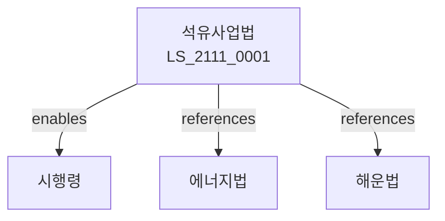

# 석유사업법

> [법률 제20171호, 2024. 1. 9., 일부개정]

---

---

## 제1장 총칙
### 제1조 (목적)
이 법은 석유사업의 건전한 발전을 도모하고 석유의 안정적 공급에 이바지함을 목적으로 한다。

### 제2조 (정의)
이 법에서 사용하는 용어의 뜻은 다음과 같다。

1. "석유"란 원유ㆍ석유제품을 말한다。
2. "석유정제"란 원유를 정제하는 것을 말한다。
3. "석유사업"이란 석유를 정제ㆍ수출입ㆍ판매하는 사업을 말한다。
4. "석유비축"이란 석유를 비축하는 것을 말한다.

---

## 제2장 석유정제
### 第5条(석유정제사업)
석유정제사업은 등록하여야 한다。
### 第6条(정제시설)
정제시설기준을 정한다。
### 第7条(정제품질)
석유제품의 품질기준을 정한다。
### 第8条(정제검사)
석유제품 검사를 실시한다。

---

## 제3장 석유판매
### 第15条(석유판매사업)
석유판매사업은 등록하여야 한다。
### 第16条(주유소)
주유소 영업은 등록하여야 한다。
### 第17条(판매기준)
석유판매기준을 정한다。
### 第18条(판매요금)
석유판매요금을 신고한다。

---

## 제4장 석유비축
### 第25条(석유비축)
석유를 비축한다。
### 第26条(비축의무)
석유사업자는 비축의무를 진다。
### 第27条(비축기준)
석유비축기준을 정한다。
### 第28条(비축관리)
석유비축을 관리한다。

---

## 제5장 석유수급
### 第35条(석유수급)
석유수급계획을 수립한다。
### 第36条(수급안정)
석유수급안정을 도모한다。
### 第37条(수입관리)
석유수입을 관리한다。
### 第38条(수출관리)
석유수출을 관리한다。

---

## 제6장 석유안전
### 第42条(석유안전)
석유재해를 예방한다。
### 第43条(안전점검)
석유시설 안전점검을 실시한다。
### 第44条(안전교육)
석유안전교육을 실시한다。
### 第45条(안전기준)
석유안전기준을 정한다。

---

## 제7장 감독
### 第52条(감독)
산업통상자원부장관은 석유사업을 감독한다。
### 第53条(보고 및 검사)
필요한 경우 보고를 명하거나 검사할 수 있다。
### 第54条(시정명령)
위법한 사항에 대하여는 시정을 명할 수 있다。
### 第55条(등록취소)
중대한 위반사유가 있는 경우 등록을 취소할 수 있다.

---

## 제8장 벌칙
### 第62条(벌칙)
다음 각 호의 어느 하나에 해당하는 자는 3년 이하의 징역 또는 3천만원 이하의 벌금에 처한다.

1. 등록 없이 석유사업을 영위한 자
2. 석유제품을 위조한 자
### 第63条(과태료)
다음 각 호의 어느 하나에 해당하는 자에게는 2천만원 이하의 과태료를 부과한다.

1. 보고를 하지 아니한 자
2. 검사를 거부한 자

---

## 관계 그래프

**상위 법령**
- [[헌법]] 제119조 (경제자유)
- [[에너지이용합리화법]]

**관련 법령**
- [[해운법]]
- [[항만법]]
- [[가스사업법]]
- [[환경정책기본법]]

**하위 법령**
- [[석유사업법 시행령]]
