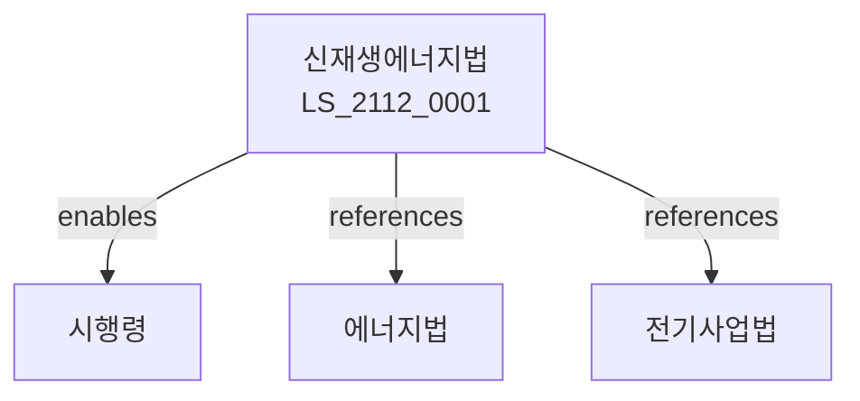

# 신재생에너지 개발 이용 및 보급 촉진법

> [법률 제20172호, 2024. 1. 9., 일부개정]

---

---

## 제1장 총칙
### 제1조 (목적)
이 법은 신재생에너지의 개발ㆍ이용 및 보급을 촉진하여 에너지안보와 환경보전에 이바지함을 목적으로 한다。

### 제2조 (정의)
이 법에서 사용하는 용어의 뜻은 다음과 같다。

1. "신재생에너지"란 태양ㆍ풍력ㆍ수력 등 재생가능에너지를 말한다。
2. "신재생에너지시설"이란 신재생에너지를 생산하는 시설을 말한다。
3. "신재생에너지공급의무"란 전기사업자의 신재생에너지 공급의무를 말한다。
4. "신재생에너지공급인증서"란 신재생에너지 생산을 인증하는 증서를 말한다.

---

## 제2장 신재생에너지정책
### 第5条(기본계획)
신재생에너지기본계획을 수립한다。
### 第6条(시행계획)
신재생에너지시행계획을 수립한다。
### 第7条(평가)
신재생에너지정책을 평가한다。
### 第8条(조정)
신재생에너지정책을 조정한다.

---

## 제3장 신재생에너지개발
### 第15条(개발사업)
신재생에너지개발사업을 추진한다。
### 第16条(기술개발)
신재생에너지기술을 개발한다。
### 第17条(실증사업)
신재생에너지실증사업을 추진한다。
### 第18条(개발지원)
신재생에너지개발을 지원한다。

---

## 제4장 신재생에너지보급
### 第25条(보급사업)
신재생에너지보급사업을 추진한다。
### 第26条(보급지원)
신재생에너지보급을 지원한다。
### 第27条(보급확대)
신재생에너지보급을 확대한다。
### 第28条(보급인센티브)
신재생에너지보급 인센티브를 제공한다。

---

## 제5장 공급의무제도
### 第35条(공급의무)
전기사업자는 신재생에너지공급의무를 진다。
### 第36条(의무비율)
신재생에너지공급의무비율을 정한다。
### 第37条(공급인증서)
신재생에너지공급인증서를 발급한다。
### 第38条(의무이행)
신재생에너지공급의무를 이행한다。

---

## 제6장 신재생에너지산업
### 第42条(산업육성)
신재생에너지산업을 육성한다。
### 第43条(기업지원)
신재생에너지기업을 지원한다。
### 第44条(수출지원)
신재생에너지수출을 지원한다。
### 第45条(인력양성)
신재생에너지인력을 양성한다.

---

## 제7장 감독
### 第52条(감독)
산업통상자원부장관은 신재생에너지사업을 감독한다。
### 第53条(보고 및 검사)
필요한 경우 보고를 명하거나 검사할 수 있다。
### 第54条(시정명령)
위법한 사항에 대하여는 시정을 명할 수 있다。
### 第55条(의무부과)
공급의무를 부과할 수 있다.

---

## 제8장 벌칙
### 第62条(과태료)
다음 각 호의 어느 하나에 해당하는 자에게는 3천만원 이하의 과태료를 부과한다.

1. 보고를 하지 아니한 자
2. 검사를 거부한 자

---

## 관계 그래프

**상위 법령**
- [[헌법]] 제119조 (경제자유)
- [[에너지이용합리화법]]

**관련 법령**
- [[전기사업법]]
- [[기후변화대응법]]
- [[환경정책기본법]]
- [[과학기술기본법]]

**하위 법령**
- [[신재생에너지법 시행령]]
