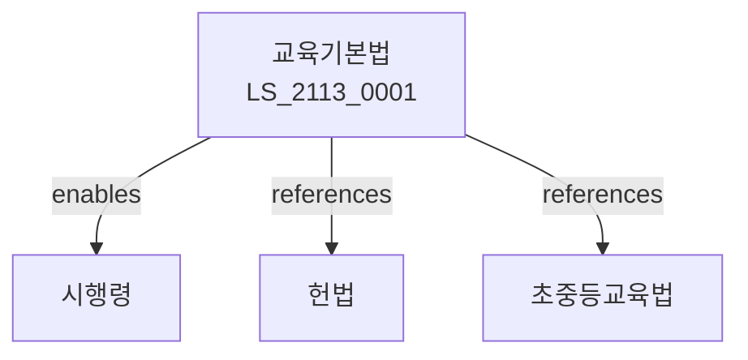

# 교육기본법

> [법률 제20173호, 2024. 1. 9., 일부개정]

---

---

## 제1장 총칙
### 제1조 (목적)
이 법은 교육에 관한 국민의 권리와 의무 및 국가의 책임을 정하고 교육제도의 기본을 확립함을 목적으로 한다。

### 제2조 (정의)
이 법에서 사용하는 용어의 뜻은 다음과 같다。

1. "교육"이란 인격을 도야하고 지식을 함양하는 활동을 말한다。
2. "학교교육"이란 학교에서 실시하는 교육을 말한다。
3. "평생교육"이란 학교교육 외의 교육을 말한다。
4. "학습자"란 교육을 받는 자를 말한다.

---

## 제2장 교육이념
### 第5条(교육이념)
교육은 홍익인간의 이념을 실현한다。
### 第6条(교육목표)
교육의 목표를 정한다。
### 第7条(교육본질)
교육의 본질을 정한다。
### 第8条(교육가치)
교육의 가치를 추구한다。

---

## 제3장 국민의 권리와 의무
### 第15条(학습권)
국민은 평생 학습할 권리를 가진다。
### 第16条(교육받을 권리)
국민은 능력에 따라 교육받을 권리를 가진다。
### 第17条(교육의무)
국민은 의무교육을 받을 의무를 진다。
### 第18条(교육참여)
국민은 교육에 참여할 권리를 가진다。

---

## 제4장 교육재정
### 第25条(교육재정)
국가는 교육재정을 확보한다。
### 第26条(교육예산)
교육예산을 편성한다。
### 第27条(교육세)
교육세를 부과할 수 있다。
### 第28条(교육투자)
교육에 투자한다。

---

## 제5장 교육행정
### 第35条(교육행정)
교육행정을 운영한다。
### 第36条(교육자치)
교육자치를 보장한다。
### 第37条(교육감)
교육감을 선출한다。
### 第38条(교육청)
교육청을 설치한다。

---

## 제6장 감독
### 第42条(감독)
교육부장관은 교육사업을 감독한다。
### 第43条(보고 및 검사)
필요한 경우 보고를 명하거나 검사할 수 있다。
### 第44条(시정명령)
위법한 사항에 대하여는 시정을 명할 수 있다。
### 第45条(조정)
교육분쟁을 조정할 수 있다.

---

## 제7장 벌칙
### 第52条(과태료)
다음 각 호의 어느 하나에 해당하는 자에게는 2천만원 이하의 과태료를 부과한다。

1. 보고를 하지 아니한 자
2. 검사를 거부한 자

---

## 관계 그래프

**상위 법령**
- [[헌법]] 제31조 (교육권)
- [[헌법]]

**관련 법령**
- [[초중등교육법]]
- [[고등교육법]]
- [[평생교육법]]
- [[지방교육자치법]]

**하위 법령**
- [[교육기본법 시행령]]
