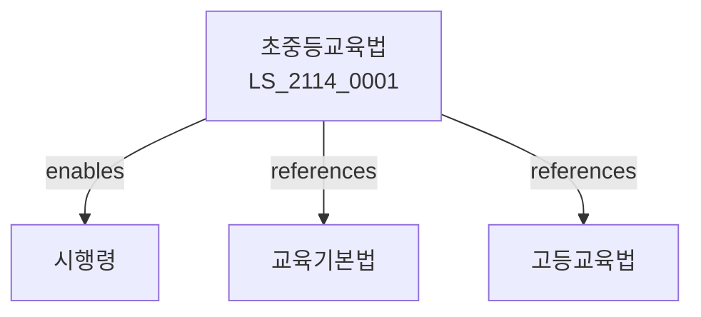

# 초ㆍ중등교육법

> [법률 제20174호, 2024. 1. 9., 일부개정]

---

---

## 제1장 총칙
### 제1조 (목적)
이 법은 초ㆍ중등교육의 제도와 운영에 관한 사항을 정함으로써 국민의 교육권 보장에 이바지함을 목적으로 한다。

### 제2조 (정의)
이 법에서 사용하는 용어의 뜻은 다음과 같다。

1. "초등교육"이란 초등학교에서 실시하는 교육을 말한다。
2. "중등교육"이란 중학교 및 고등학교에서 실시하는 교육을 말한다。
3. "의무교육"이란 국민이 받아야 할 교육을 말한다。
4. "학교"란 초ㆍ중등교육을 실시하는 학교를 말한다。

---

## 제2장 학교제도
### 第5条(학교종류)
학교는 초등학교ㆍ중학교ㆍ고등학교로 구분한다。
### 第6条(수업연한)
학교의 수업연한을 정한다。
### 第7条(학기)
학기를 정한다。
### 第8条(수업일수)
수업일수를 정한다。

---

## 제3장 의무교육
### 第15条(의무교육)
초등학교 및 중학교 교육은 의무교육으로 한다。
### 第16条(취학의무)
의무교육 대상자는 취학하여야 한다。
### 第17条(취학보호)
의무교육 취학을 보호한다。
### 第18条(무상교육)
의무교육은 무상으로 한다.

---

## 제4장 교육과정
### 第25条(교육과정)
교육과정을 정한다。
### 第26条(교육과정기준)
교육과정 기준을 정한다。
### 第27条(교과서)
교과서를 검정 또는 인정한다。
### 第28条(교육과정운영)
교육과정을 운영한다。

---

## 제5장 학교운영
### 第35条(학교운영)
학교를 운영한다。
### 第36条(학교장)
학교장의 직무를 정한다。
### 第37条(교원)
교원의 자격을 정한다。
### 第38条(학교운영위원회)
학교운영위원회를 둔다。

---

## 제6장 학생
### 第42条(학생)
학생의 권리와 의무를 정한다。
### 第43条(학생생활)
학생생활지도를 한다。
### 第44条(진로지도)
진로지도를 한다。
### 第45条(학생복지)
학생복지를 지원한다.

---

## 제7장 감독
### 第52条(감독)
교육부장관은 초중등교육사업을 감독한다。
### 第53条(보고 및 검사)
필요한 경우 보고를 명하거나 검사할 수 있다。
### 第54条(시정명령)
위법한 사항에 대하여는 시정을 명할 수 있다。
### 第55条(인가취소)
중대한 위반사유가 있는 경우 인가를 취소할 수 있다.

---

## 제8장 벌칙
### 第62条(벌칙)
다음 각 호의 어느 하나에 해당하는 자는 2년 이하의 징역 또는 2천만원 이하의 벌금에 처한다.

1. 의무교육을 방해한 자
2. 허위로 학적을 조작한 자
### 第63条(과태료)
다음 각 호의 어느 하나에 해당하는 자에게는 2천만원 이하의 과태료를 부과한다.

1. 보고를 하지 아니한 자
2. 검사를 거부한 자

---

## 관계 그래프

**상위 법령**
- [[헌법]] 제31조 (교육권)
- [[교육기본법]]

**관련 법령**
- [[고등교육법]]
- [[유아교육법]]
- [[특수교육법]]
- [[교원법]]

**하위 법령**
- [[초중등교육법 시행령]]
