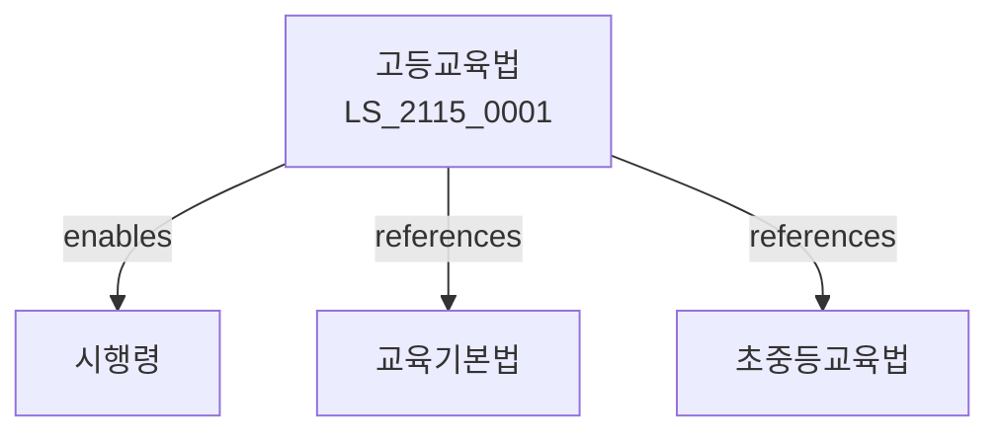

# 고등교육법

> [법률 제20175호, 2024. 1. 9., 일부개정]

---

---

## 제1장 총칙
### 제1조 (목적)
이 법은 고등교육의 제도와 운영에 관한 사항을 정함으로써 국가사회의 발전에 이바지함을 목적으로 한다。

### 제2조 (정의)
이 법에서 사용하는 용어의 뜻은 다음과 같다。

1. "고등교육"이란 대학 등에서 실시하는 교육을 말한다。
2. "대학"이란 고등교육을 실시하는 학교를 말한다。
3. "학위"이란 학문적 성취를 인정하는 칭호를 말한다。
4. "교원"이란 대학의 교수 등을 말한다.

---

## 제2장 대학제도
### 第5条(대학종류)
대학은 4년제대학ㆍ전문대학 등으로 구분한다。
### 第6条(설립)
대학은 국립ㆍ공립ㆍ사립으로 설립할 수 있다。
### 第7条(설치인가)
대학 설치는 인가를 받아야 한다。
### 第8条(학칙)
대학은 학칙을 제정한다。

---

## 제3장 학사제도
### 第15条(학사운영)
대학은 학사를 자율적으로 운영한다。
### 第16条(입학)
입학은 대학이 자율적으로 선발한다。
### 第17条(학위)
학위를 수여한다。
### 第18条(학점]
학점을 인정한다。

---

## 제4장 교원
### 第25条(교원종류)
교원은 교수ㆍ부교수ㆍ조교수ㆍ전임강사로 구분한다。
### 第26条(자격)
교원의 자격을 정한다。
### 第27条(임용)
교원을 임용한다。
### 第28条(신분보장)
교원의 신분을 보장한다.

---

## 제5장 대학재정
### 第35条(대학재정)
대학재정을 확보한다。
### 第36条(등록금)
등록금을 정한다。
### 第37条(국고보조)
국고보조를 지급할 수 있다。
### 第38条(장학금)
장학금을 지급할 수 있다.

---

## 제6장 대학평가
### 第42条(대학평가)
대학평가를 실시한다。
### 第43条(평가기준)
평가기준을 정한다。
### 第44条(평가공시)
평가결과를 공시한다。
### 第45条(평가활용)
평가결과를 활용한다.

---

## 제7장 감독
### 第52条(감독)
교육부장관은 고등교육사업을 감독한다。
### 第53条(보고 및 검사)
필요한 경우 보고를 명하거나 검사할 수 있다。
### 第54条(시정명령)
위법한 사항에 대하여는 시정을 명할 수 있다。
### 第55条(인가취소)
중대한 위반사유가 있는 경우 인가를 취소할 수 있다.

---

## 제8장 벌칙
### 第62条(벌칙)
다음 각 호의 어느 하나에 해당하는 자는 3년 이하의 징역 또는 3천만원 이하의 벌금에 처한다.

1. 허위로 학위를 수여한 자
2. 인가 없이 대학을 설립한 자
### 第63条(과태료)
다음 각 호의 어느 하나에 해당하는 자에게는 2천만원 이하의 과태료를 부과한다。

1. 보고를 하지 아니한 자
2. 검사를 거부한 자

---

## 관계 그래프

**상위 법령**
- [[헌법]] 제31조 (교육권)
- [[교육기본법]]

**관련 법령**
- [[초중등교육법]]
- [[평생교육법]]
- [[학점인정법]]
- [[교원법]]

**하위 법령**
- [[고등교육법 시행령]]
