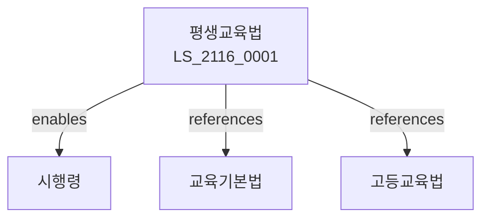

# 평생교육법

> [법률 제20176호, 2024. 1. 9., 일부개정]

---

---

## 제1장 총칙
### 제1조 (목적)
이 법은 평생교육을 진흥하여 국민의 평생학습을 지원함을 목적으로 한다。

### 제2조 (정의)
이 법에서 사용하는 용어의 뜻은 다음과 같다。

1. "평생교육"이란 학교교육 외의 모든 교육활동을 말한다。
2. "평생학습"이란 평생에 걸친 학습활동을 말한다。
3. "평생교육시설"이란 평생교육을 실시하는 시설을 말한다。
4. "평생교육사"이란 평생교육을 담당하는 자를 말한다.

---

## 제2장 평생교육진흥
### 第5条(기본계획)
평생교육진흥기본계획을 수립한다。
### 第6条(시행계획)
평생교육진흥시행계획을 수립한다。
### 第7条(평가)
평생교육을 평가한다。
### 第8条(조정)
평생교육정책을 조정한다.

---

## 제3장 평생교육시설
### 第15条(평생교육시설)
평생교육시설을 설치할 수 있다。
### 第16条(시설등록)
평생교육시설은 등록할 수 있다。
### 第17条(시설기준)
평생교육시설기준을 정한다。
### 第18条(시설지원)
평생교육시설을 지원한다。

---

## 제4장 평생교육프로그램
### 第25条(교육프로그램)
평생교육프로그램을 개발한다。
### 第26条(프로그램인정)
교육프로그램을 인정할 수 있다。
### 第27条(프로그램평가)
교육프로그램을 평가한다。
### 第28条(프로그램지원)
교육프로그램을 지원한다。

---

## 제5장 평생교육사
### 第35条(평생교육사)
평생교육사를 양성한다。
### 第36条(자격)
평생교육사 자격을 정한다。
### 第37条(연수)
평생교육사 연수를 실시한다。
### 第38条(배치)
평생교육사를 배치할 수 있다.

---

## 제6장 학습계좌제
### 第42条(학습계좌)
학습계좌제를 운영한다。
### 第43条(학습이력)
학습이력을 관리한다。
### 第44条(학점인정]
학점을 인정할 수 있다。
### 第45条(학위취득]
학위를 취득할 수 있다.

---

## 제7장 감독
### 第52条(감독)
교육부장관은 평생교육사업을 감독한다。
### 第53条(보고 및 검사)
필요한 경우 보고를 명하거나 검사할 수 있다。
### 第54条(시정명령)
위법한 사항에 대하여는 시정을 명할 수 있다。
### 第55条(등록취소)
중대한 위반사유가 있는 경우 등록을 취소할 수 있다.

---

## 제8장 벌칙
### 第62条(과태료)
다음 각 호의 어느 하나에 해당하는 자에게는 2천만원 이하의 과태료를 부과한다。

1. 보고를 하지 아니한 자
2. 검사를 거부한 자

---

## 관계 그래프

**상위 법령**
- [[헌법]] 제31조 (교육권)
- [[교육기본법]]

**관련 법령**
- [[고등교육법]]
- [[학점인정등에관한법률]]
- [[직업교육훈련촉진법]]
- [[도서관법]]

**하위 법령**
- [[평생교육법 시행령]]
