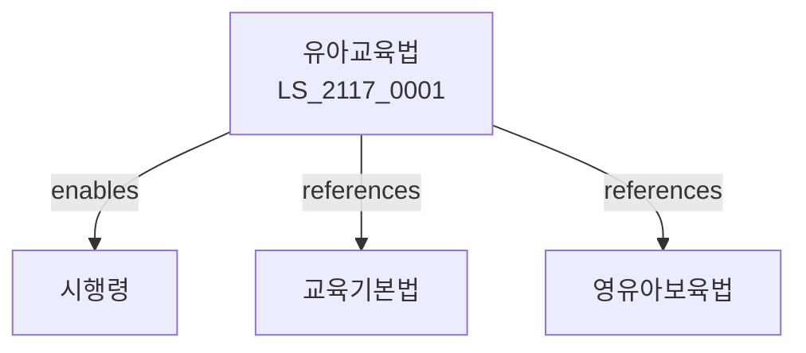

# 유아교육법

> [법률 제20177호, 2024. 1. 9., 일부개정]

---

---

## 제1장 총칙
### 제1조 (목적)
이 법은 유아의 교육에 관한 사항을 정함으로써 유아의 건전한 성장에 이바지함을 목적으로 한다。

### 제2조 (정의)
이 법에서 사용하는 용어의 뜻은 다음과 같다。

1. "유아"란 만 3세부터 만 5세까지의 어린이를 말한다。
2. "유아교육"이란 유아를 대상으로 하는 교육을 말한다。
3. "유치원"이란 유아교육을 실시하는 학교를 말한다。
4. "유아교사"이란 유치원에서 교육을 담당하는 자를 말한다。

---

## 제2장 유치원
### 第5条(유치원설립)
유치원을 설립할 수 있다。
### 第6条(설립인가)
유치원 설립은 인가를 받아야 한다。
### 第7条(유치원종류)
유치원은 국립ㆍ공립ㆍ사립으로 구분한다。
### 第8条(학급]
학급을 편성한다。

---

## 제3장 유아교육
### 第15条(교육과정]
유아교육과정을 정한다。
### 第16条(교육내용)
유아교육 내용을 정한다。
### 第17条(교육방법]
유아교육 방법을 정한다。
### 第18条(교육평가]
유아교육을 평가한다。

---

## 제4장 무상교육
### 第25条(무상교육)
유아교육은 무상으로 한다。
### 第26条(지원대상]
무상교육 지원대상을 정한다。
### 第27条(지원내용]
무상교육 지원내용을 정한다。
### 第28条(지원절차]
무상교육 지원절차를 정한다.

---

## 제5章 유아교사
### 第35条(유아교사)
유아교사의 자격을 정한다。
### 第36条(자격증)
유아교사 자격증을 발급한다。
### 第37条(연수]
유아교사 연수를 실시한다。
### 第38条(배치]
유아교사를 배치한다.

---

## 第6장 감독
### 第39条(감독)
교육부장관은 유아교육사업을 감독한다。
### 第40条(보고 및 검사)
필요한 경우 보고를 명하거나 검사할 수 있다。
### 第41条(시정명령)
위법한 사항에 대하여는 시정을 명할 수 있다。
### 第42条(인가취소]
중대한 위반사유가 있는 경우 인가를 취소할 수 있다.

---

## 제7장 벌칙
### 第43条(과태료)
다음 각 호의 어느 하나에 해당하는 자에게는 1천만원 이하의 과태료를 부과한다。

1. 보고를 하지 아니한 자
2. 검사를 거부한 자

---

## 관계 그래프

**상위 법령**
- [[헌법]] 제31조 (교육권)
- [[교육기본법]]

**관련 법령**
- [[영유아보육법]]
- [[초중등교육법]]
- [[아동복지법]]
- [[유아교육진흥법]]

**하위 법령**
- [[유아교육법 시행령]]
