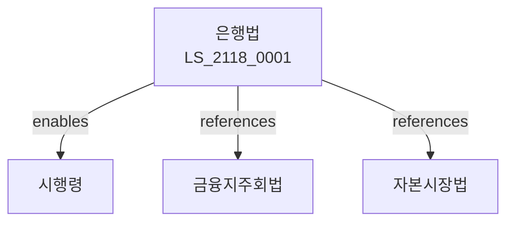

# 은행법

> [법률 제20178호, 2024. 1. 9., 일부개정]

---

---

## 제1장 총칙
### 제1조 (목적)
이 법은 은행업무를 건전하게 육성하고 예금자 등을 보호함으로써 국민경제의 발전에 이바지함을 목적으로 한다。

### 제2조 (정의)
이 법에서 사용하는 용어의 뜻은 다음과 같다.
1. "은행"이란 예금을 받고 자금을 대출하는 금융기관을 말한다.
2. "은행업무"란 예금ㆍ대출ㆍ환전 업무를 말한다.
3. "예금자"란 은행에 예금을 하는 자를 말한다.
4. "차입자"란 은행으로부터 자금을 차입하는 자를 말한다.

---

## 제2장 은행의 설립
### 第5条(설립인가)
은행을 설립하려는 자는 인가를 받아야 한다.
### 第6条(인가요건)
인가요건은 자본금ㆍ인력 등을 갖추어야 한다.
### 第7条(인가절차)
금융위원회에 인가를 신청한다.
### 第8条(등기)
인가를 받은 자는 등기하여야 한다.

---

## 제3장 은행업무
### 第15条(예금업무)
은행은 예금을 받을 수 있다.
### 第16条(대출업무)
은행은 자금을 대출할 수 있다.
### 第17条(환전업무)
은행은 환전업무를 할 수 있다.
### 第18条(부수업무)
은행은 부수업무를 할 수 있다.

---

## 제4장 건전경영
### 第25条(건전경영)
은행은 건전하게 경영하여야 한다.
### 第26条(자기자본)
은행은 자기자본을 유지하여야 한다.
### 第27条(유동성)
은행은 유동성을 유지하여야 한다.
### 第28条(위험관리)
은행은 위험을 관리하여야 한다.

---

## 제5장 감독
### 第35条(감독)
금융위원회는 은행을 감독한다.
### 第36条(보고 및 검사)
필요한 경우 보고를 명하거나 검사할 수 있다.
### 第37条(시정명령)
위법한 사항에 대하여는 시정을 명할 수 있다.
### 第38条(영업정지)
중대한 위반사유가 있는 경우 영업정지를 명할 수 있다.

---

## 제6장 예금자보호
### 第42条(예금자보호)
예금자를 보호한다.
### 第43条(예금보험)
예금보험제도를 운영한다.
### 第44条(지급보장)
예금지급을 보장한다.
### 第45条(정보공시)
예금자에게 정보를 제공한다.

---

## 제7장 벌칙
### 第52条(벌칙)
다음 각 호의 어느 하나에 해당하는 자는 5년 이하의 징역 또는 5천만원 이하의 벌금에 처한다.
1. 인가 없이 은행업무를 영위한 자
2. 허위로 인가를 받은 자
### 第53条(과태료)
다음 각 호의 어느 하나에 해당하는 자에게는 3천만원 이하의 과태료를 부과한다.
1. 보고를 하지 아니한 자
2. 검사를 거부한 자

---

## 관계 그래프

**상위 법령**
- [[헌법]] 제119조 (경제자유)
- [[금융지주회법]]

**관련 법령**
- [[자본시장법]]
- [[보험업법]]
- [[여신전문금융업법]]
- [[예금자보호법]]

**하위 법령**
- [[은행법 시행령]]
