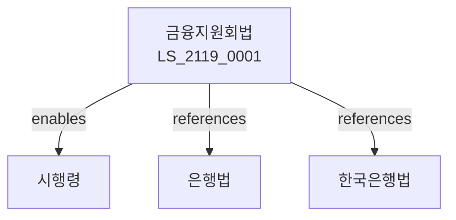

# 금융지원회의 설치 등에 관한 법률

> [법률 제20179호, 2024. 1. 9., 일부개정]

---

---

## 제1장 총칙
### 제1조 (목적)
이 법은 금융지원회의 설치 등에 관한 사항을 정함으로써 금융산업의 건전한 발전에 이바지함을 목적으로 한다.
### 제2조 (정의)
이 법에서 사용하는 용어의 뜻은 다음과 같다.
1. "금융지원회"란 금융기관에 자금을 지원하는 기관을 말한다.
2. "금융기관"란 은행ㆍ보험회사 등을 말한다.
3. "지원자금"이란 금융지원회가 지원하는 자금을 말한다.
4. "출자"란 금융지원회에 출자하는 것을 말한다.
---

## 제2장 금융지원회
### 第5条(설치)
금융지원회를 설치한다.
### 第6条(법인격)
금융지원회는 법인으로 한다.
### 第7条(자본금)
금융지원회의 자본금을 정한다.
### 第8条(출자)
정부는 금융지원회에 출자할 수 있다.
---

## 제3장 업무
### 第15条(지원업무)
금융지원회는 지원업무를 수행한다.
### 第16条(자금지원)
금융기관에 자금을 지원한다.
### 第17条(출자지원)
금융기관에 출자를 지원한다.
### 第18条(보증지원)
금융기관에 보증을 지원한다.
---

## 제4장 재무회계
### 第25条(회계)
금융지원회는 회계를 정리한다.
### 第26条(재무제표)
재무제표를 작성한다.
### 第27条(결산)
매 사업년도 결산을 한다.
### 第28条(잉여금)
결산잉여금을 처리한다.
---

## 제5장 감독
### 第35条(감독)
기획재정부장관은 금융지원회를 감독한다.
### 第36条(보고 및 검사)
필요한 경우 보고를 명하거나 검사할 수 있다.
### 第37条(시정명령)
위법한 사항에 대하여는 시정을 명할 수 있다.
### 第38条(임원해임)
중대한 위반사유가 있는 경우 임원을 해임할 수 있다.
---

## 제6장 보칙
### 第42条(한국은행협조)
금융지원회는 한국은행과 협조한다.
### 第43条(예금보험공사협조)
예금보험공사와 협조한다.
### 第44条(세제지원)
세제지원을 할 수 있다.
### 第45条(규제경감)
규제를 경감할 수 있다.
---

## 제7장 벌칙
### 第52条(과태료)
다음 각 호의 어느 하나에 해당하는 자에게는 3천만원 이하의 과태료를 부과한다.
1. 보고를 하지 아니한 자
2. 검사를 거부한 자
---

## 관계 그래프

**상위 법령**
- [[헌법]] 제119조 (경제자유)
- [[한국은행법]]

**관련 법령**
- [[은행법]]
- [[보험업법]]
- [[예금자보호법]]
- [[자본시장법]]

**하위 법령**
- [[금융지원회법 시행령]]
