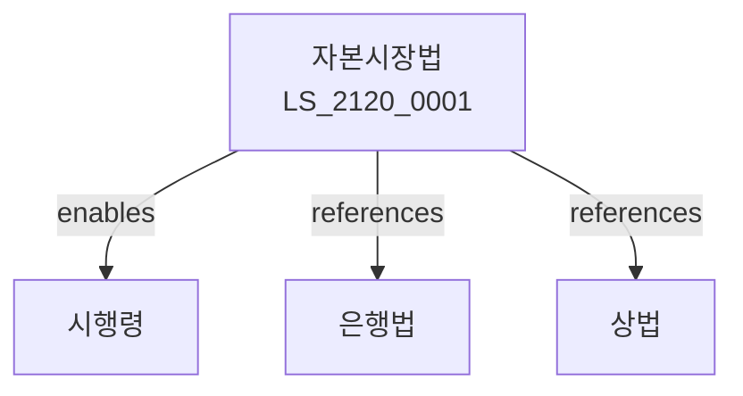

# 자본시장과 금융투자업에 관한 법률

> [법률 제20180호, 2024. 1. 9., 일부개정]

---

---

## 제1장 총칙
### 제1조 (목적)
이 법은 자본시장을 육성하고 금융투자업을 건전하게 발전시켜 국민경제에 이바지함을 목적으로 한다.
### 제2조 (정의)
이 법에서 사용하는 용어의 뜻은 다음과 같다.
1. "자본시장"이란 유가증권시장 등을 말한다.
2. "금융투자업"이란 투자매매업ㆍ투자중개업 등을 말한다.
3. "유가증권"이란 주식ㆍ채권 등을 말한다.
4. "투자자"란 금융투자상품에 투자하는 자를 말한다.
---

## 제2장 금융투자업
### 第5条(투자매매업)
투자매매업은 등록하여야 한다.
### 第6条(투자중개업)
투자중개업은 등록하여야 한다.
### 第7条(집합투자업)
집합투자업은 등록하여야 한다.
### 第8条(신탁업)
신탁업은 등록하여야 한다.
---

## 제3장 유가증권 발행
### 第15条(유가증권신고)
유가증권 발행은 신고하여야 한다.
### 第16条(공시)
발행인은 정보를 공시하여야 한다.
### 第17条(모집)
유가증권을 모집할 수 있다.
### 第18条(매매)
유가증권을 매매할 수 있다.
---

## 제4장 증권시장
### 第25条(증권시장)
증권시장을 설립할 수 있다.
### 第26条(상장)
유가증권을 상장할 수 있다.
### 第27条(폐지)
상장을 폐지할 수 있다.
### 第28条(공시)
상장법인은 정보를 공시하여야 한다.
---

## 제5장 불공정거래
### 第35条(불공정거래금지)
불공정거래를 금지한다.
### 第36条(시세조종)
시세조종을 금지한다.
### 第37条(미공개정보이용)
미공개정보 이용을 금지한다.
### 第38条(내부자거래)
내부자거래를 금지한다.
---

## 제6장 투자자보호
### 第42条(투자자보호)
투자자를 보호한다.
### 第43条(적합성원칙)
적합성원칙을 준수하여야 한다.
### 第44条(설명의무)
설명의무를 다하여야 한다.
### 第45条(분쟁조정)
분쟁을 조정할 수 있다.
---

## 제7장 감독
### 第52条(감독)
금융위원회는 자본시장을 감독한다.
### 第53条(보고 및 검사)
필요한 경우 보고를 명하거나 검사할 수 있다.
### 第54条(시정명령)
위법한 사항에 대하여는 시정을 명할 수 있다.
### 第55条(등록취소)
중대한 위반사유가 있는 경우 등록을 취소할 수 있다.
---

## 제8장 벌칙
### 第62条(벌칙)
다음 각 호의 어느 하나에 해당하는 자는 10년 이하의 징역 또는 1억원 이하의 벌금에 처한다.
1. 내부자거래를 한 자
2. 시세조종을 한 자
### 第63条(과태료)
다음 각 호의 어느 하나에 해당하는 자에게는 5천만원 이하의 과태료를 부과한다.
1. 보고를 하지 아니한 자
2. 검사를 거부한 자
---

## 관계 그래프

**상위 법령**
- [[헌법]] 제119조 (경제자유)
- [[상법]]

**관련 법령**
- [[은행법]]
- [[보험업법]]
- [[여신전문금융업법]]
- [[회계법]]

**하위 법령**
- [[자본시장법 시행령]]
