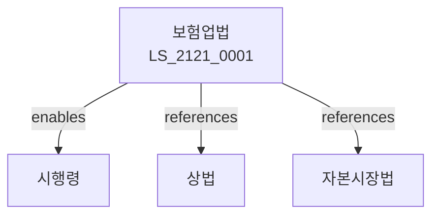

# 보험업법

> [법률 제20181호, 2024. 1. 9., 일부개정]

---

---

## 제1장 총칙
### 제1조 (목적)
이 법은 보험사업의 건전한 발전을 도모하고 보험계약자를 보호함으로써 국민경제의 발전에 이바지함을 목적으로 한다.
### 제2조 (정의)
이 법에서 사용하는 용어의 뜻은 다음과 같다.
1. "보험"이란 우연한 사고로 인한 손해를 보상하는 제도를 말한다.
2. "보험사업"이란 보험을 업으로 하는 것을 말한다.
3. "보험계약자"란 보험계약을 체결하는 자를 말한다.
4. "보험금"이란 보험사고 발생 시 지급되는 금전을 말한다.
---

## 제2장 보험사업
### 第5条(보험사업)
보험사업은 인가를 받아야 한다.
### 第6条(생명보험)
생명보험사업을 영위할 수 있다.
### 第7条(손해보험)
손해보험사업을 영위할 수 있다.
### 第8条(재보험)
재보험사업을 영위할 수 있다.
---

## 제3장 보험계약
### 第15条(보험계약)
보험계약을 체결할 수 있다.
### 第16条(보험료)
보험료를 납부하여야 한다.
### 第17条(보험금지급)
보험사고 발생 시 보험금을 지급한다.
### 第18条(계약해지)
보험계약을 해지할 수 있다.
---

## 제4장 보험상품
### 第25条(보험상품)
보험상품을 개발할 수 있다.
### 第26条(인가)
보험상품은 인가를 받아야 한다.
### 第27条(공시)
보험상품 내용을 공시한다.
### 第28条(변경)
보험상품을 변경할 수 있다.
---

## 제5장 경영건전성
### 第35条(지급여력)
보험회사는 지급여력을 유지하여야 한다.
### 第36条(책임준비금)
책임준비금을 적립하여야 한다.
### 第37条(자산운용)
자산을 건전하게 운용하여야 한다.
### 第38条(위험관리)
위험을 관리하여야 한다.
---

## 제6장 계약자보호
### 第42条(계약자보호)
보험계약자를 보호한다.
### 第43条(최량이익원칙)
최량이익원칙을 준수하여야 한다.
### 第44条(설명의무)
설명의무를 다하여야 한다.
### 第45条(비밀보호)
보험계약자의 비밀을 보호한다.
---

## 제7장 감독
### 第52条(감독)
금융위원회는 보험사업을 감독한다.
### 第53条(보고 및 검사)
필요한 경우 보고를 명하거나 검사할 수 있다.
### 第54条(시정명령)
위법한 사항에 대하여는 시정을 명할 수 있다.
### 第55条(영업정지)
중대한 위반사유가 있는 경우 영업정지를 명할 수 있다.
---

## 제8장 벌칙
### 第62条(벌칙)
다음 각 호의 어느 하나에 해당하는 자는 5년 이하의 징역 또는 5천만원 이하의 벌금에 처한다.
1. 인가 없이 보험사업을 영위한 자
2. 허위로 보험금을 청구한 자
### 第63条(과태료)
다음 각 호의 어느 하나에 해당하는 자에게는 3천만원 이하의 과태료를 부과한다.
1. 보고를 하지 아니한 자
2. 검사를 거부한 자
---

## 관계 그래프

**상위 법령**
- [[헌법]] 제119조 (경제자유)
- [[상법]]

**관련 법령**
- [[자본시장법]]
- [[은행법]]
- [[보험모니터링법]]
- [[금융지원회법]]

**하위 법령**
- [[보험업법 시행령]]
