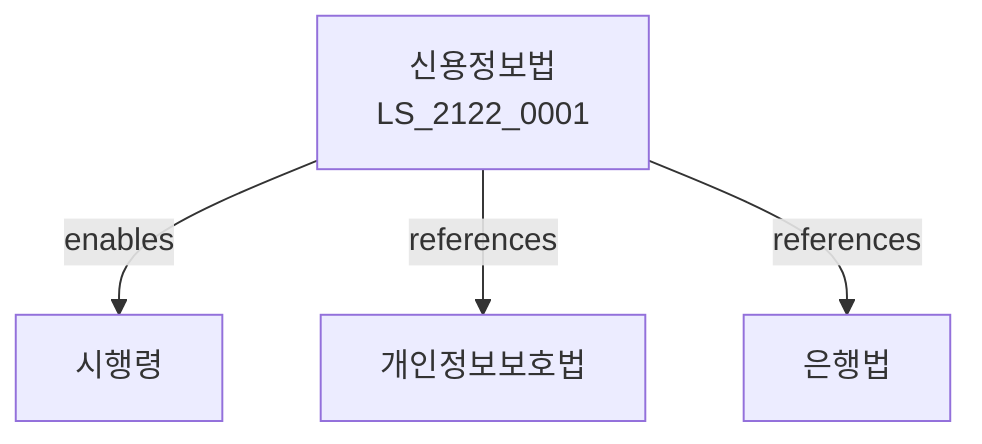

# 신용정보의 이용 및 보호에 관한 법률

> [법률 제20182호, 2024. 1. 9., 일부개정]

---

---

## 제1장 총칙
### 제1조 (목적)
이 법은 신용정보의 효율적 이용과 신용정보주체의 권익보호에 이바지함을 목적으로 한다.
### 제2조 (정의)
이 법에서 사용하는 용어의 뜻은 다음과 같다.
1. "신용정보"란 신용거래 능력을 판단할 수 있는 정보를 말한다.
2. "신용정보주체"란 신용정보에 의하여 식별되는 자를 말한다.
3. "신용정보업"이란 신용정보를 수집ㆍ제공하는 업무를 말한다.
4. "신용조회"란 신용정보를 조회하는 것을 말한다.
---

## 제2장 신용정보업
### 第5条(신용정보업)
신용정보업은 등록하여야 한다.
### 第6条(신용평가업)
신용평가업은 등록하여야 한다.
### 第7条(신용조회업)
신용조회업은 등록하여야 한다.
### 第8条(등록요건)
등록요건을 정한다.
---

## 제3장 신용정보 수집
### 第15条(수집)
신용정보를 수집할 수 있다.
### 第16条(수집제한)
신용정보 수집을 제한할 수 있다.
### 第17条(정보주체동의)
정보주체의 동의를 받아야 한다.
### 第18条(정보제공)
신용정보를 제공할 수 있다.
---

## 제4장 신용정보 보호
### 第25条(보호)
신용정보를 보호한다.
### 第26条(비밀유지)
신용정보의 비밀을 유지하여야 한다.
### 第27条(정정청구)
정보주체는 정정을 청구할 수 있다.
### 第28条(삭제청구)
정보주체는 삭제를 청구할 수 있다.
---

## 제5장 신용점수
### 第35条(신용점수)
신용점수를 산출할 수 있다.
### 第36条(산출기준)
신용점수 산출기준을 정한다.
### 第37条(공시)
신용점수 산출방법을 공시한다.
### 第38条(이의신청)
신용점수에 이의를 신청할 수 있다.
---

## 제6장 감독
### 第42条(감독)
금융위원회는 신용정보업을 감독한다.
### 第43条(보고 및 검사)
필요한 경우 보고를 명하거나 검사할 수 있다.
### 第44条(시정명령)
위법한 사항에 대하여는 시정을 명할 수 있다.
### 第45条(등록취소)
중대한 위반사유가 있는 경우 등록을 취소할 수 있다.
---

## 제7장 벌칙
### 第52条(벌칙)
다음 각 호의 어느 하나에 해당하는 자는 5년 이하의 징역 또는 5천만원 이하의 벌금에 처한다.
1. 신용정보를 부당하게 이용한 자
2. 신용정보를 유출한 자
### 第53条(과태료)
다음 각 호의 어느 하나에 해당하는 자에게는 3천만원 이하의 과태료를 부과한다.
1. 보고를 하지 아니한 자
2. 검사를 거부한 자
---

## 관계 그래프

**상위 법령**
- [[헌법]] 제17조 (사생활비밀)
- [[개인정보보호법]]

**관련 법령**
- [[은행법]]
- [[자본시장법]]
- [[정보통신망법]]
- [[금융실명법]]

**하위 법령**
- [[신용정보법 시행령]]
