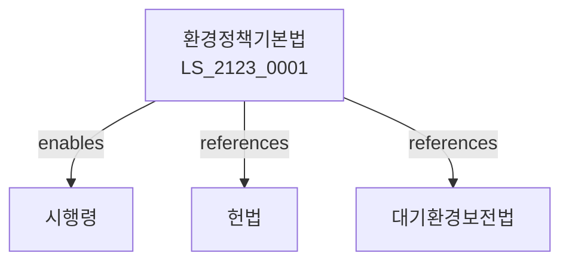

# 환경정책기본법

> [법률 제20183호, 2024. 1. 9., 일부개정]

---

---

## 제1장 총칙
### 제1조 (목적)
이 법은 환경보전에 관한 국민의 권리와 의무 및 국가의 책임을 정함으로써 환경오염을 방지하고 쾌적한 환경을 조성함을 목적으로 한다。

### 제2조 (정의)
이 법에서 사용하는 용어의 뜻은 다음과 같다。
1. "환경"이란 자연환경과 생활환경을 말한다。
2. "환경오염"이란 환경을 오염시키는 것을 말한다。
3. "환경보전"이란 환경을 보호하고 보존하는 것을 말한다。
4. "환경영향평가"란 환경에 미치는 영향을 평가하는 것을 말한다。

---

## 제2장 환경정책
### 第5条(기본계획)
환경보전기본계획을 수립한다。
### 第6条(시행계획)
환경보전시행계획을 수립한다。
### 第7条(평가)
환경정책을 평가한다。
### 第8条(조정)
환경정책을 조정한다。

---

## 제3장 환경기준
### 第15条(환경기준)
환경보전을 위한 기준을 정한다。
### 第16条(대기기준)
대기환경기준을 정한다。
### 第17条(수질기준)
수질환경기준을 정한다。
### 第18条(토양기준)
토양환경기준을 정한다。

---

## 제4장 환경영향평가
### 第25条(평가대상)
환경영향평가 대상사업을 정한다。
### 第26条(평가서작성)
환경영향평가서를 작성한다。
### 第27条(평가협의)
환경영향평가를 협의한다。
### 第28条(평가후관리)
환경영향평가 후 관리한다。

---

## 제5장 환경분쟁
### 第35条(분쟁조정)
환경분쟁을 조정한다。
### 第36条(조정신청)
환경분쟁조정을 신청한다。
### 第37条(조정절차)
환경분쟁조정절차를 정한다。
### 第38条(조정결정)
환경분쟁조정결정을 한다。

---

## 제6장 환경개선부담금
### 第42条(부담금)
환경개선부담금을 부과한다。
### 第43条(부과대상)
부과대상을 정한다。
### 第44条(부과기준)
부과기준을 정한다。
### 第45条(징수)
부담금을 징수한다。

---

## 제7장 감독
### 第52条(감독)
환경부장관은 환경보전사업을 감독한다。
### 第53条(보고 및 검사)
필요한 경우 보고를 명하거나 검사할 수 있다。
### 第54条(시정명령)
위법한 사항에 대하여는 시정을 명할 수 있다。
### 第55条(조치명령)
환경오염 방지를 위한 조치를 명할 수 있다。

---

## 제8장 벌칙
### 第62条(과태료)
다음 각 호의 어느 하나에 해당하는 자에게는 3천만원 이하의 과태료를 부과한다。

1. 보고를 하지 아니한 자
2. 검사를 거부한 자

---

## 관계 그래프

**상위 법령**
- [[헌법]] 제35조 (환경권)
- [[지속가능개발기본법]]

**관련 법령**
- [[대기환경보전법]]
- [[수질환경보전법]]
- [[폐기물관리법]]
- [[자연환경보전법]]

**하위 법령**
- [[환경정책기본법 시행령]]
