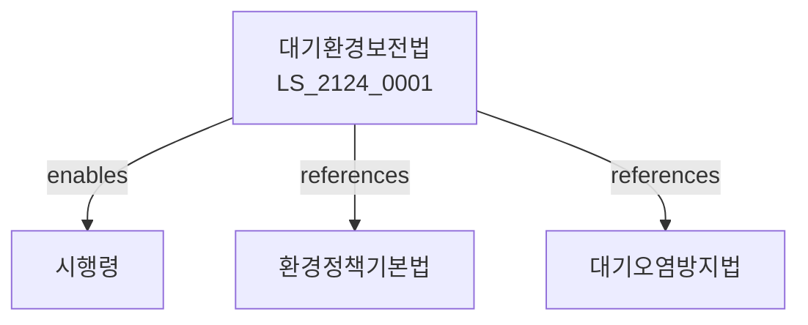

# 대기환경보전법

> [법률 제20184호, 2024. 1. 9., 일부개정]

---

---

## 제1장 총칙
### 제1조 (목적)
이 법은 대기오염을 방지하고 대기환경을 적정하게 관리함으로써 국민건강과 생활환경을 보호함을 목적으로 한다。

### 제2조 (정의)
이 법에서 사용하는 용어의 뜻은 다음과 같다。
1. "대기오염"이란 대기 중의 오염물질로 인한 오염을 말한다。
2. "오염물질"이란 대기를 오염시키는 물질을 말한다。
3. "배출시설"이란 오염물질을 배출하는 시설을 말한다。
4. "방지시설"이란 오염물질을 제거하는 시설을 말한다。

---

## 제2장 배출허용기준
### 第5条(배출허용기준)
배출허용기준을 정한다。
### 第6条(기준적용)
배출허용기준을 적용한다。
### 第7条(기준강화)
배출허용기준을 강화할 수 있다。
### 第8条(특별대책지역)
대기환경개선 특별대책지역을 지정할 수 있다。

---

## 제3장 배출시설
### 第15条(배출시설설치)
배출시설은 신고하여야 한다。
### 第16条(방지시설)
방지시설을 설치하여야 한다。
### 第17条(조업정지)
오염물질 배출 시 조업정지를 명할 수 있다。
### 第18条(개선명령)
오염물질 배출 감소를 명할 수 있다。

---

## 제4장 자동차관리
### 第25条(자동차배출)
자동차 배출가스를 관리한다。
### 第26条(배출허용기준)
자동차 배출허용기준을 정한다。
### 第27条(정기검사)
자동차 정기검사를 실시한다。
### 第28条(운행제한)
배출가스 과다차량 운행을 제한할 수 있다。

---

## 제5장 대기오염경보
### 第35条(경보발령)
대기오염경보를 발령할 수 있다。
### 第36条(경보단계)
경보단계를 정한다。
### 第37条(조치)
경보발령 시 조치를 한다。
### 第38条(해제)
경보를 해제한다。

---

## 제6장 감독
### 第42条(감독)
환경부장관은 대기환경보전사업을 감독한다。
### 第43条(보고 및 검사)
필요한 경우 보고를 명하거나 검사할 수 있다。
### 第44条(시정명령)
위법한 사항에 대하여는 시정을 명할 수 있다。
### 第45条(조업정지)
중대한 위반사유가 있는 경우 조업정지를 명할 수 있다。

---

## 제7장 벌칙
### 第52条(벌칙)
다음 각 호의 어느 하나에 해당하는 자는 3년 이하의 징역 또는 3천만원 이하의 벌금에 처한다。

1. 배출허용기준을 위반한 자
2. 방지시설을 설치하지 아니한 자
### 第53条(과태료)
다음 각 호의 어느 하나에 해당하는 자에게는 2천만원 이하의 과태료를 부과한다。

1. 보고를 하지 아니한 자
2. 검사를 거부한 자

---

## 관계 그래프

**상위 법령**
- [[헌법]] 제35조 (환경권)
- [[환경정책기본법]]

**관련 법령**
- [[수질환경보전법]]
- [[소음진동규제법]]
- [[자동차관리법]]
- [[산업안전보건법]]

**하위 법령**
- [[대기환경보전법 시행령]]
