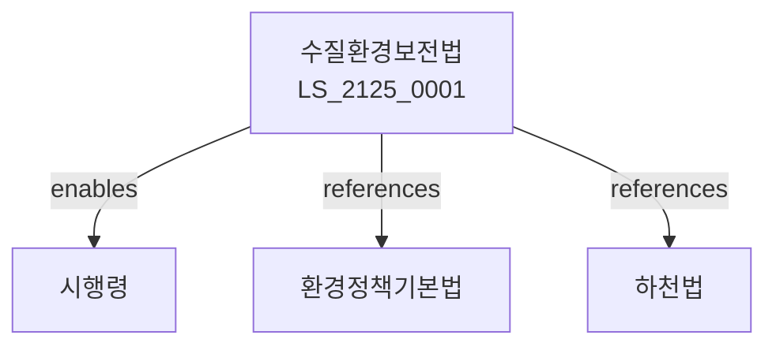

# 수질환경보전법

> [법률 제20185호, 2024. 1. 9., 일부개정]

---

---

## 제1장 총칙
### 제1조 (목적)
이 법은 수질오염을 방지하고 수질환경을 적정하게 관리함으로써 국민건강과 생활환경을 보호함을 목적으로 한다。

### 제2조 (정의)
이 법에서 사용하는 용어의 뜻은 다음과 같다。
1. "수질오염"이란 수질을 오염시키는 것을 말한다。
2. "오염물질"이란 수질을 오염시키는 물질을 말한다。
3. "배출시설"이란 오염물질을 배출하는 시설을 말한다。
4. "방지시설"이란 오염물질을 제거하는 시설을 말한다。

---

## 제2장 수질환경기준
### 第5条(수질기준)
수질환경기준을 정한다。
### 第6条(배출허용기준)
배출허용기준을 정한다。
### 第7条(기준강화)
수질기준을 강화할 수 있다。
### 第8条(특별대책지역)
수질환경개선 특별대책지역을 지정할 수 있다。

---

## 제3장 배출시설
### 第15条(배출시설설치)
배출시설은 신고 또는 허가를 받아야 한다。
### 第16条(방지시설)
방지시설을 설치하여야 한다。
### 第17条(조업정지)
오염물질 배출 시 조업정지를 명할 수 있다。
### 第18条(개선명령)
오염물질 배출 감소를 명할 수 있다。

---

## 제4장 하수도
### 第25条(하수도)
하수도를 설치한다。
### 第26条(하수처리)
하수를 처리한다。
### 第27条(방류수기준)
방류수기준을 정한다。
### 第28条(하수도요금)
하수도요금을 징수한다。

---

## 제5장 상수원보호
### 第35条(상수원보호)
상수원을 보호한다。
### 第36条(보호구역)
상수원보호구역을 지정한다。
### 第37条(행위제한)
보호구역 내 행위를 제한한다。
### 第38条(오염방지)
상수원오염을 방지한다。

---

## 제6장 감독
### 第42条(감독)
환경부장관은 수질환경보전사업을 감독한다。
### 第43条(보고 및 검사)
필요한 경우 보고를 명하거나 검사할 수 있다。
### 第44条(시정명령)
위법한 사항에 대하여는 시정을 명할 수 있다。
### 第45条(조업정지)
중대한 위반사유가 있는 경우 조업정지를 명할 수 있다。

---

## 제7장 벌칙
### 第52条(벌칙)
다음 각 호의 어느 하나에 해당하는 자는 3년 이하의 징역 또는 3천만원 이하의 벌금에 처한다。

1. 배출허용기준을 위반한 자
2. 방지시설을 설치하지 아니한 자
### 第53条(과태료)
다음 각 호의 어느 하나에 해당하는 자에게는 2천만원 이하의 과태료를 부과한다。

1. 보고를 하지 아니한 자
2. 검사를 거부한 자

---

## 관계 그래프

**상위 법령**
- [[헌법]] 제35조 (환경권)
- [[환경정책기본법]]

**관련 법령**
- [[하천법]]
- [[대기환경보전법]]
- [[폐기물관리법]]
- [[수도법]]

**하위 법령**
- [[수질환경보전법 시행령]]
