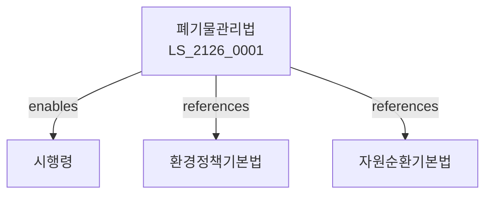

# 폐기물관리법

> [법률 제20186호, 2024. 1. 9., 일부개정]

---

---

## 제1장 총칙
### 제1조 (목적)
이 법은 폐기물의 적정처리와 재활용을 도모함으로써 환경보전과 자원절약에 이바지함을 목적으로 한다。

### 제2조 (정의)
이 법에서 사용하는 용어의 뜻은 다음과 같다。
1. "폐기물"이란 쓰레기ㆍ연소재 등을 말한다。
2. "생활폐기물"이란 일상생활에서 배출되는 폐기물을 말한다。
3. "사업장폐기물"이란 사업활동에서 배출되는 폐기물을 말한다。
4. "지정폐기물"이란 환경부령으로 지정하는 폐기물을 말한다。

---

## 제2장 폐기물처리
### 第5条(폐기물처리)
폐기물은 적정하게 처리하여야 한다。
### 第6条(배출자의무)
배출자는 처리의무를 진다。
### 第7条(처리기준)
폐기물처리기준을 정한다。
### 第8条(처리시설)
폐기물처리시설을 설치한다。

---

## 제3장 생활폐기물
### 第15条(생활폐기물)
생활폐기물을 관리한다。
### 第16条(분리배출)
생활폐기물을 분리배출한다。
### 第17条(수거)
생활폐기물을 수거한다。
### 第18条(처리)
생활폐기물을 처리한다。

---

## 제4장 사업장폐기물
### 第25条(사업장폐기물)
사업장폐기물을 관리한다。
### 第26条(배출신고)
사업장폐기물 배출을 신고한다。
### 第27条(처리위탁)
사업장폐기물을 위탁처리할 수 있다。
### 第28条(처리업)
폐기물처리업을 등록한다。

---

## 제5章 재활용
### 第35条(재활용)
폐기물을 재활용한다。
### 第36条(재활용제품)
재활용제품을 권장한다。
### 第37条(재활용의무)
제품의 재활용의무를 정한다。
### 第38条(보증금)
재활용보증금을 예치할 수 있다.

---

## 제6장 감독
### 第42条(감독)
환경부장관은 폐기물관리사업을 감독한다。
### 第43条(보고 및 검사)
필요한 경우 보고를 명하거나 검사할 수 있다。
### 第44条(시정명령)
위법한 사항에 대하여는 시정을 명할 수 있다。
### 第45条(영업정지)
중대한 위반사유가 있는 경우 영업정지를 명할 수 있다。

---

## 제7장 벌칙
### 第52条(벌칙)
다음 각 호의 어느 하나에 해당하는 자는 5년 이하의 징역 또는 5천만원 이하의 벌금에 처한다。

1. 무단투기를 한 자
2. 허가 없이 처리업을 영위한 자
### 第53条(과태료)
다음 각 호의 어느 하나에 해당하는 자에게는 3천만원 이하의 과태료를 부과한다。

1. 보고를 하지 아니한 자
2. 검사를 거부한 자

---

## 관계 그래프

**상위 법령**
- [[헌법]] 제35조 (환경권)
- [[환경정책기본법]]

**관련 법령**
- [[자원순환기본법]]
- [[대기환경보전법]]
- [[수질환경보전법]]
- [[오염손해배상법]]

**하위 법령**
- [[폐기물관리법 시행령]]
