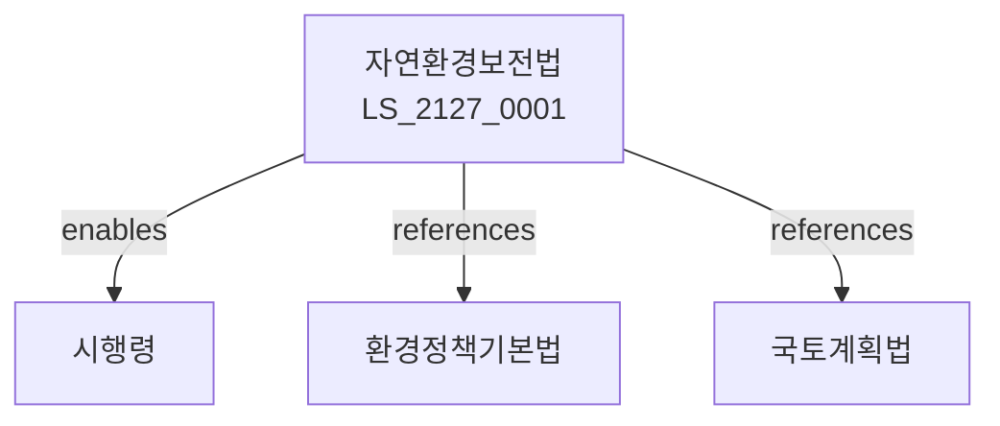

# 자연환경보전법

> [법률 제20187호, 2024. 1. 9., 일부개정]

---

---

## 제1장 총칙
### 제1조 (목적)
이 법은 자연환경을 보전하고 자연생태계를 유지함으로써 국민의 건강과 생활환경을 보호함을 목적으로 한다。

### 제2조 (정의)
이 법에서 사용하는 용어의 뜻은 다음과 같다。
1. "자연환경"이란 자연상태의 환경을 말한다。
2. "자연생태계"란 자연환경의 생태계를 말한다。
3. "보전지역"이란 자연환경을 보전하는 지역을 말한다。
4. "야생동식물"이란 자연상태의 동식물을 말한다。

---

## 제2장 자연환경보전계획
### 第5条(기본계획)
자연환경보전기본계획을 수립한다。
### 第6条(시행계획)
자연환경보전시행계획을 수립한다。
### 第7条(조사)
자연환경실태를 조사한다。
### 第8条(평가)
자연환경보전사업을 평가한다。

---

## 제3장 생태계보전
### 第15条(생태계보전)
자연생태계를 보전한다。
### 第16条(생태계복원)
훼손된 생태계를 복원한다。
### 第17条(생태계관리)
생태계를 관리한다。
### 第18条(생태계조사)
생태계조사를 실시한다。

---

## 제4장 야생동식물
### 第25条(야생동식물보호)
야생동식물을 보호한다。
### 第26条(멸종위기종)
멸종위기야생동식물을 보호한다。
### 第27条(포획금지)
야생동물 포획을 금지한다。
### 第28条(채취금지)
야생식물 채취를 금지한다。

---

## 제5장 자연보전지역
### 第35条(자연보전지역)
자연보전지역을 지정할 수 있다。
### 第36条(생태보전지역)
생태계보전지역을 지정할 수 있다。
### 第37条(행위제한)
보전지역 내 행위를 제한한다。
### 第38条(관리)
자연보전지역을 관리한다。

---

## 제6장 감독
### 第42条(감독)
환경부장관은 자연환경보전사업을 감독한다。
### 第43条(보고 및 검사)
필요한 경우 보고를 명하거나 검사할 수 있다。
### 第44条(시정명령)
위법한 사항에 대하여는 시정을 명할 수 있다。
### 第45条(복구명령)
자연환경훼손 시 복구를 명할 수 있다。

---

## 제7장 벌칙
### 第52条(벌칙)
다음 각 호의 어느 하나에 해당하는 자는 3년 이하의 징역 또는 3천만원 이하의 벌금에 처한다。

1. 멸종위기종을 포획한 자
2. 보전지역을 훼손한 자
### 第53条(과태료)
다음 각 호의 어느 하나에 해당하는 자에게는 2천만원 이하의 과태료를 부과한다。

1. 보고를 하지 아니한 자
2. 검사를 거부한 자

---

## 관계 그래프

**상위 법령**
- [[헌법]] 제35조 (환경권)
- [[환경정책기본법]]

**관련 법령**
- [[국토계획법]]
- [[산림기본법]]
- [[해양환경관리법]]
- [[문화재보호법]]

**하위 법령**
- [[자연환경보전법 시행령]]
