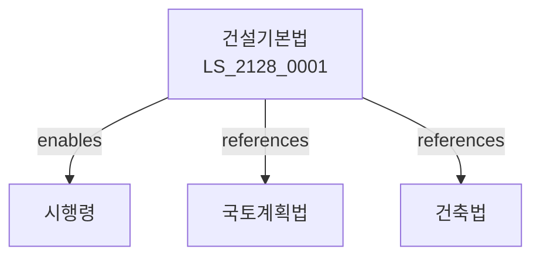

# 건설기본법

> [법률 제20188호, 2024. 1. 9., 일부개정]

---

---

## 제1장 총칙
### 제1조 (목적)
이 법은 건설산업의 건전한 발전과 건설기술의 진보를 도모함으로써 국민경제의 발전에 이바지함을 목적으로 한다.

### 제2조 (정의)
이 법에서 사용하는 용어의 뜻은 다음과 같다。
1. "건설공사"란 건축물 등을 신축ㆍ증축하거나 개량하는 공사를 말한다。
2. "건설업"이란 건설공사를 업으로 하는 것을 말한다。
3. "건설기술자"란 건설기술에 관한 기술자를 말한다。
4. "건설사업자"란 건설업을 영위하는 자를 말한다。

---

## 제2장 건설사업자
### 第5条(건설업등록)
건설사업자는 등록하여야 한다。
### 第6条(등록결격사유)
등록결격사유를 정한다。
### 第7条(결격사유해소)
결격사유를 해소할 수 있다。
### 第8条(영업범위)
건설사업자의 영업범위를 정한다。

---

## 제3장 건설공사
### 第15条(건설공사)
건설공사를 시행한다。
### 第16条(도급)
건설공사 도급계약을 체결한다。
### 第17条(하도급)
건설공사 하도급을 할 수 있다。
### 第18条(공사감리)
건설공사 감리를 실시한다。

---

## 제4장 건설기술
### 第25条(건설기술)
건설기술을 개발한다。
### 第26条(기술개발)
건설기술개발을 지원한다。
### 第27条(기술인력)
건설기술인력을 양성한다。
### 第28条(자격제도)
건설기술자격제도를 운영한다。

---

## 제5장 품질관리
### 第35条(품질관리)
건설공사 품질을 관리한다。
### 第36条(품질검사)
건설공사 품질검사를 실시한다。
### 第37条(하자보수)
건설공사 하자보수를 한다。
### 第38条(하자담보)
하자담보책임을 정한다。

---

## 제6장 감독
### 第42条(감독)
국토교통부장관은 건설사업을 감독한다。
### 第43条(보고 및 검사)
필요한 경우 보고를 명하거나 검사할 수 있다。
### 第44条(시정명령)
위법한 사항에 대하여는 시정을 명할 수 있다。
### 第45条(영업정지)
중대한 위반사유가 있는 경우 영업정지를 명할 수 있다。

---

## 제7장 벌칙
### 第52条(벌칙)
다음 각 호의 어느 하나에 해당하는 자는 3년 이하의 징역 또는 3천만원 이하의 벌금에 처한다。

1. 등록 없이 건설업을 영위한 자
2. 하도급 제한을 위반한 자
### 第53条(과태료)
다음 각 호의 어느 하나에 해당하는 자에게는 2천만원 이하의 과태료를 부과한다。

1. 보고를 하지 아니한 자
2. 검사를 거부한 자

---

## 관계 그래프

**상위 법령**
- [[헌법]] 제35조 (거주이전의 자유)
- [[국토계획법]]

**관련 법령**
- [[건축법]]
- [[주택법]]
- [[도시개발법]]
- [[건설기술 진흥법]]

**하위 법령**
- [[건설기본법 시행령]]
