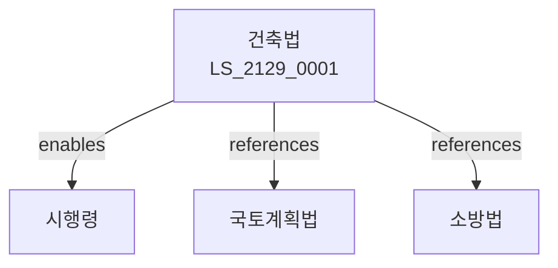

# 건축법

> [법률 제20189호, 2024. 1. 9., 일부개정]

---

---

## 제1장 총칙
### 제1조 (목적)
이 법은 건축물의 대지ㆍ구조ㆍ설비 및 용도 등에 관한 기준을 정함으로써 건축물의 안전ㆍ기능 및 미관을 향상시켜 공공복리의 증진에 이바지함을 목적으로 한다。

### 제2조 (정의)
이 법에서 사용하는 용어의 뜻은 다음과 같다。
1. "건축물"이란 토지에 정착하는 공작물을 말한다。
2. "대지"란 건축물이 있는 토지를 말한다。
3. "건축"이란 건축물을 신축ㆍ증축하는 것을 말한다。
4. "용적률"이란 대지면적에 대한 건축면적의 비율을 말한다。

---

## 제2장 건축물의 대지
### 第5条(대지)
건축물의 대지기준을 정한다。
### 第6条(대지안전)
대지의 안전을 확보한다。
### 第7条(접도)
대지는 도로에 접하여야 한다。
### 第8条(대지규모)
대지의 최소규모를 정한다。

---

## 제3장 건축물의 구조
### 第15条(구조내력)
건축물의 구조내력을 확보한다。
### 第16条(내진설계)
내진설계기준을 정한다。
### 第17条(방화구조)
방화구조기준을 정한다。
### 第18条(피난시설)
피난시설을 설치한다。

---

## 제4장 건축물의 설비
### 第25条(설비)
건축물의 설비기준을 정한다。
### 第26条(급수설비)
급수설비를 설치한다。
### 第27条(배수설비)
배수설비를 설치한다。
### 第28条(환기설비)
환기설비를 설치한다。

---

## 제5장 용도지역
### 第35条(용도지역)
용도지역을 지정한다。
### 第36条(건폐율)
건폐율을 정한다。
### 第37条(용적률)
용적률을 정한다。
### 第38条(높이제한)
건축물 높이를 제한한다。

---

## 제6장 건축허가
### 第42条(건축허가)
건축허가를 받아야 한다。
### 第43条(신고)
건축신고를 하여야 한다。
### 第44条(사용승인)
건축물 사용승인을 받아야 한다。
### 第45条(임시사용)
임시사용승인을 받을 수 있다。

---

## 제7장 감독
### 第52条(감독)
시장ㆍ군수는 건축물을 감독한다。
### 第53条(보고 및 검사)
필요한 경우 보고를 명하거나 검사할 수 있다。
### 第54条(시정명령)
위법한 사항에 대하여는 시정을 명할 수 있다。
### 第55条(철거명령)
위법 건축물에 대하여 철거를 명할 수 있다。

---

## 제8장 벌칙
### 第62条(벌칙)
다음 각 호의 어느 하나에 해당하는 자는 3년 이하의 징역 또는 3천만원 이하의 벌금에 처한다。

1. 허가 없이 건축한 자
2. 용도변경을 무단으로 한 자
### 第63条(과태료)
다음 각 호의 어느 하나에 해당하는 자에게는 2천만원 이하의 과태료를 부과한다。

1. 보고를 하지 아니한 자
2. 검사를 거부한 자

---

## 관계 그래프

**상위 법령**
- [[헌법]] 제35조 (거주이전의 자유)
- [[국토계획법]]

**관련 법령**
- [[건설기본법]]
- [[소방법]]
- [[주택법]]
- [[도시계획법]]

**하위 법령**
- [[건축법 시행령]]
