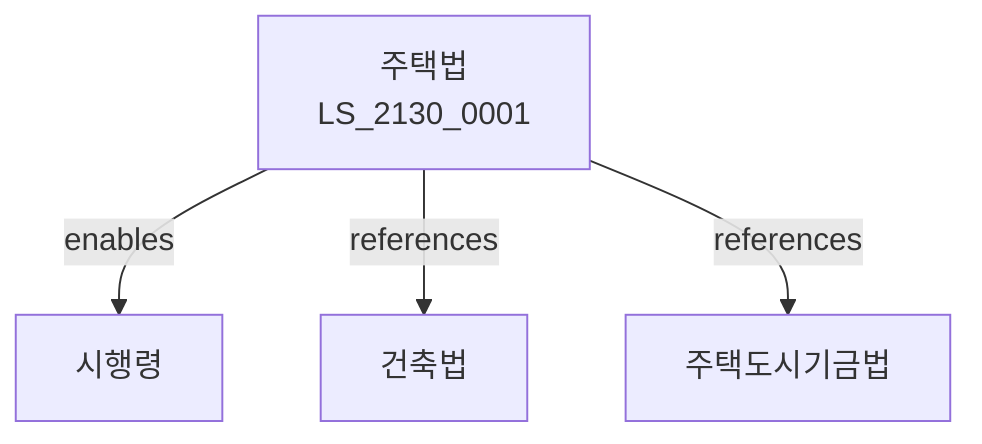

# 주택법

> [법률 제20190호, 2024. 1. 9., 일부개정]

---

---

## 제1장 총칙
### 제1조 (목적)
이 법은 주택의 건설ㆍ공급 및 관리에 관한 사항을 정함으로써 국민의 주거안정과 주거생활 향상에 이바지함을 목적으로 한다。

### 제2조 (정의)
이 법에서 사용하는 용어의 뜻은 다음과 같다。
1. "주택"이란 거주용 건축물을 말한다。
2. "공동주택"이란 여러 가구가 거주하는 주택을 말한다。
3. "분양"이란 주택을 공급하는 것을 말한다。
4. "임대"이란 주택을 빌려주는 것을 말한다。

---

## 제2장 주택건설
### 第5条(주택건설)
주택을 건설할 수 있다。
### 第6条(사업계획)
주택건설사업계획을 승인받아야 한다。
### 第7条(분양승인)
주택분양승인을 받아야 한다。
### 第8条(분양가격)
분양가격을 공고한다。

---

## 제3장 주택공급
### 第15条(주택공급)
주택을 공급한다。
### 第16条(청약)
주택 청약을 할 수 있다。
### 第17条(당첨)
청약당첨자를 선정한다。
### 第18条(계약)
주택계약을 체결한다。

---

## 제4장 주택관리
### 第25条(주택관리)
공동주택을 관리한다。
### 第26条(관리주체)
관리주체를 지정한다。
### 第27条(관리비)
관리비를 부과한다。
### 第28条(적립금)
적립금을 적립한다。

---

## 제5장 임대주택
### 第35条(임대주택)
임대주택을 공급한다。
### 第36条(임대의무)
임대의무기간을 정한다。
### 第37条(임대료)
임대료를 정한다。
### 第38条(우선공급)
임대주택을 우선공급한다。

---

## 제6장 주택도시기금
### 第42条(주택도시기금)
주택도시기금을 운용한다。
### 第43条(기금재원)
기금재원을 조성한다。
### 第44条(기금용도)
기금용도를 정한다。
### 第45条(기금운용)
기금운용계획을 수립한다。

---

## 제7장 감독
### 第52条(감독)
국토교통부장관은 주택사업을 감독한다。
### 第53条(보고 및 검사)
필요한 경우 보고를 명하거나 검사할 수 있다。
### 第54条(시정명령)
위법한 사항에 대하여는 시정을 명할 수 있다。
### 第55条(영업정지)
중대한 위반사유가 있는 경우 영업정지를 명할 수 있다。

---

## 제8장 벌칙
### 第62条(벌칙)
다음 각 호의 어느 하나에 해당하는 자는 5년 이하의 징역 또는 5천만원 이하의 벌금에 처한다。

1. 허가 없이 주택건설사업을 영위한 자
2. 분양가를 초과하여 징수한 자
### 第63条(과태료)
다음 각 호의 어느 하나에 해당하는 자에게는 3천만원 이하의 과태료를 부과한다。

1. 보고를 하지 아니한 자
2. 검사를 거부한 자

---

## 관계 그래프

**상위 법령**
- [[헌법]] 제35조 (주거권)
- [[건축법]]

**관련 법령**
- [[건설기본법]]
- [[국토계획법]]
- [[도시개발법]]
- [[주택도시기금법]]

**하위 법령**
- [[주택법 시행령]]
