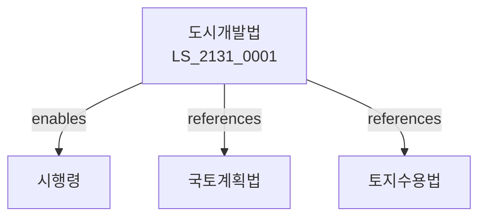

# 도시개발법

> [법률 제20191호, 2024. 1. 9., 일부개정]

---

---

## 제1장 총칙
### 제1조 (목적)
이 법은 도시개발사업에 관한 사항을 정함으로써 도시의 체계적인 개발과 건전한 발전에 이바지함을 목적으로 한다。

### 제2조 (정의)
이 법에서 사용하는 용어의 뜻은 다음과 같다。
1. "도시개발사업"이란 도시를 개발하는 사업을 말한다。
2. "개발구역"이란 도시개발사업을 시행하는 구역을 말한다。
3. "시행자"란 도시개발사업을 시행하는 자를 말한다。
4. "공공시설"이란 공공용 시설을 말한다。

---

## 제2장 도시개발구역
### 第5条(개발구역지정)
도시개발구역을 지정할 수 있다。
### 第6条(지정기준)
개발구역지정기준을 정한다。
### 第7条(지정해제)
개발구역지정을 해제할 수 있다。
### 第8条(변경)
개발구역을 변경할 수 있다。

---

## 제3장 도시개발사업
### 第15条(사업시행)
도시개발사업을 시행한다。
### 第16条(시행자)
시행자를 지정한다。
### 第17条(사업계획)
사업계획을 수립한다。
### 第18条(실시계획)
실시계획을 작성한다。

---

## 제4장 토지등
### 第25条(토지조성)
토지를 조성한다。
### 第26条(토지보상)
토지를 보상한다。
### 第27条(토지수용)
토지를 수용할 수 있다。
### 第28条(이주대책)
이주대책을 수립한다。

---

## 제5장 공공시설
### 第35条(공공시설)
공공시설을 설치한다。
### 第36条(도로)
도로를 설치한다。
### 第37条(공원)
공원을 조성한다。
### 第38条(주차장)
주차장을 설치한다。

---

## 제6장 비용
### 第42条(비용부담)
사업비용을 부담한다。
### 第43条(보조)
비용을 보조할 수 있다。
### 第44条(융자)
비용을 융자할 수 있다。
### 第45条(분양)
조성토지를 분양한다。

---

## 제7장 감독
### 第52条(감독)
국토교통부장관은 도시개발사업을 감독한다。
### 第53条(보고 및 검사)
필요한 경우 보고를 명하거나 검사할 수 있다。
### 第54条(시정명령)
위법한 사항에 대하여는 시정을 명할 수 있다。
### 第55条(사업정지)
중대한 위반사유가 있는 경우 사업정지를 명할 수 있다。

---

## 제8장 벌칙
### 第62条(벌칙)
다음 각 호의 어느 하나에 해당하는 자는 3년 이하의 징역 또는 3천만원 이하의 벌금에 처한다。

1. 허가 없이 사업을 시행한 자
2. 사업계획을 위반한 자
### 第63条(과태료)
다음 각 호의 어느 하나에 해당하는 자에게는 2천만원 이하의 과태료를 부과한다。

1. 보고를 하지 아니한 자
2. 검사를 거부한 자

---

## 관계 그래프

**상위 법령**
- [[헌법]] 제35조 (거주이전의 자유)
- [[국토계획법]]

**관련 법령**
- [[건설기본법]]
- [[건축법]]
- [[주택법]]
- [[토지수용법]]

**하위 법령**
- [[도시개발법 시행령]]
