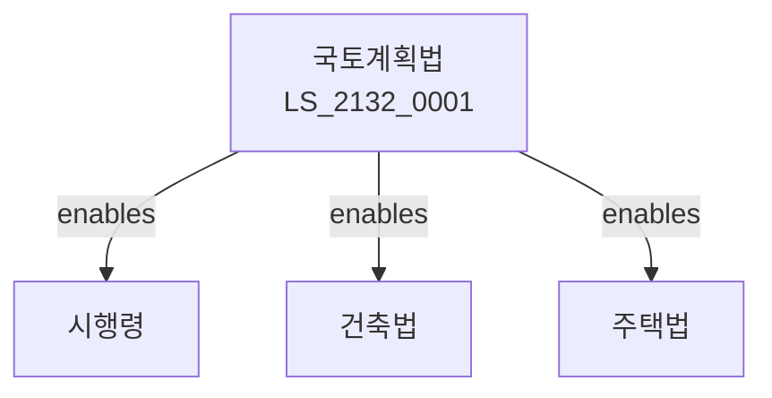

# 국토계획법

> [법률 제20192호, 2024. 1. 9., 일부개정]

---

---

## 제1장 총칙
### 제1조 (목적)
이 법은 국토의 이용ㆍ개발 및 보전에 관한 계획을 수립하고 이를 종합적으로 관리함으로써 국토의 균형있는 발전과 공공복리의 증진에 이바지함을 목적으로 한다。

### 제2조 (정의)
이 법에서 사용하는 용어의 뜻은 다음과 같다。
1. "국토계획"이란 국토이용계획을 말한다。
2. "용도지역"이란 토지이용을 제한하는 지역을 말한다。
3. "개발행위"란 토지형질변경 등을 말한다。
4. "도시관리계획"이란 도시를 관리하는 계획을 말한다。

---

## 제2장 국토계획
### 第5条(국토계획)
국토계획을 수립한다。
### 第6条(기본방향)
국토계획기본방향을 정한다。
### 第7条(수립절차)
국토계획수립절차를 정한다。
### 第8条(변경)
국토계획을 변경할 수 있다。

---

## 제3장 용도지역
### 第15条(용도지역)
용도지역을 지정한다。
### 第16条(주거지역)
주거지역을 지정한다。
### 第17条(상업지역)
상업지역을 지정한다。
### 第18条(공업지역)
공업지역을 지정한다。
### 第19条(녹지지역)
녹지지역을 지정한다。

---

## 제4장 도시관리계획
### 第25条(도시관리계획)
도시관리계획을 수립한다。
### 第26条(계획기간)
도시관리계획기간을 정한다。
### 第27条(계획내용)
도시관리계획내용을 정한다。
### 第28条(결정고시)
도시관리계획을 결정고시한다。

---

## 제5장 개발행위
### 第35条(개발행위)
개발행위를 허가받아야 한다。
### 第36条(허가기준)
개발행위허가기준을 정한다。
### 第37条(허가제한)
개발행위를 제한할 수 있다。
### 第38条(사전승인)
개발행위사전승인을 받아야 한다。

---

## 제6장 지구단위계획
### 第42条(지구단위계획)
지구단위계획을 수립한다。
### 第43条(계획구역)
지구단위계획구역을 지정한다。
### 第44条(계획내용)
지구단위계획내용을 정한다。
### 第45条(특별계획)
특별계획구역을 지정할 수 있다。

---

## 제7장 감독
### 第52条(감독)
국토교통부장관은 국토계획사업을 감독한다。
### 第53条(보고 및 검사)
필요한 경우 보고를 명하거나 검사할 수 있다。
### 第54条(시정명령)
위법한 사항에 대하여는 시정을 명할 수 있다。
### 第55条(원상회복)
개발행위 위반 시 원상회복을 명할 수 있다。

---

## 제8장 벌칙
### 第62条(벌칙)
다음 각 호의 어느 하나에 해당하는 자는 5년 이하의 징역 또는 5천만원 이하의 벌금에 처한다。

1. 허가 없이 개발행위를 한 자
2. 용도지역을 위반한 자
### 第63条(과태료)
다음 각 호의 어느 하나에 해당하는 자에게는 3천만원 이하의 과태료를 부과한다。

1. 보고를 하지 아니한 자
2. 검사를 거부한 자

---

## 관계 그래프

**상위 법령**
- [[헌법]] 제35조 (거주이전의 자유)
- [[국토기본법]]

**관련 법령**
- [[건설기본법]]
- [[건축법]]
- [[주택법]]
- [[도시개발법]]

**하위 법령**
- [[국토계획법 시행령]]
