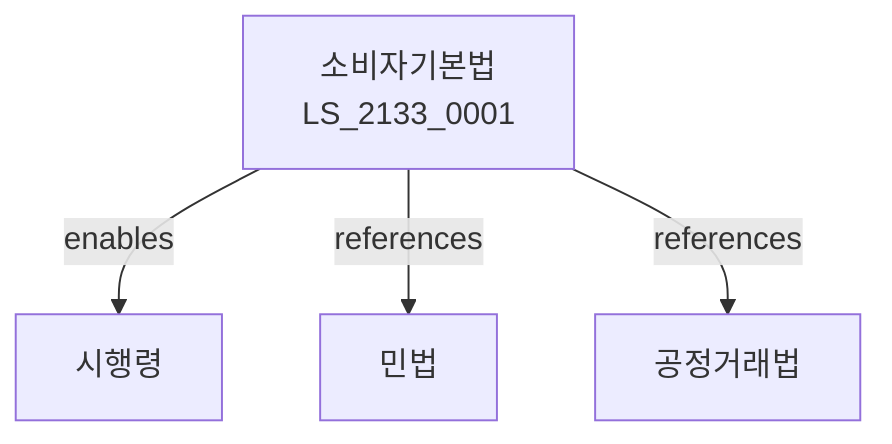

# 소비자기본법

> [법률 제20193호, 2024. 1. 9., 일부개정]

---

---

## 제1장 총칙
### 제1조 (목적)
이 법은 소비자의 권익을 보호하고 증진하기 위한 기본적인 사항을 정함으로써 소비자생활의 향상과 국민경제의 발전에 이바지함을 목적으로 한다。

### 제2조 (정의)
이 법에서 사용하는 용어의 뜻은 다음과 같다。
1. "소비자"란 물품 또는 용역을 사용하는 자를 말한다。
2. "사업자"란 물품 또는 용역을 제공하는 자를 말한다。
3. "소비자단체"란 소비자의 권익을 보호하는 단체를 말한다。
4. "소비자피해"란 소비자가 입은 피해를 말한다。

---

## 제2장 소비자의 권리
### 第5条(소비자권리)
소비자는 다음의 권리를 가진다。
### 第6条(선택권)
소비자는 물품을 자유로이 선택할 권리를 가진다。
### 第7条(정보권)
소비자는 올바른 정보를 제공받을 권리를 가진다。
### 第8条(안전권)
소비자는 안전한 물품을 사용할 권리를 가진다。

---

## 제3장 소비자정책
### 第15条(소비자정책)
정부는 소비자정책을 수립한다。
### 第16条(기본계획)
소비자보호기본계획을 수립한다。
### 第17条(시행계획)
소비자보호시행계획을 수립한다。
### 第18条(평가)
소비자정책을 평가한다。

---

## 제4장 소비자단체
### 第25条(소비자단체)
소비자단체를 설립할 수 있다。
### 第26条(지원)
소비자단체를 지원할 수 있다。
### 第27条(등록)
소비자단체를 등록할 수 있다。
### 第28条(활동)
소비자단체의 활동을 정한다。

---

## 제5장 소비자피해구제
### 第35条(피해구제)
소비자피해를 구제한다。
### 第36条(피해보상)
소비자피해를 보상한다。
### 第37条(분쟁조정)
소비자분쟁을 조정한다。
### 第38条(집단분쟁)
집단소비자분쟁을 조정한다。

---

## 제6장 감독
### 第42条(감독)
공정거래위원회는 소비자보호사업을 감독한다。
### 第43条(보고 및 검사)
필요한 경우 보고를 명하거나 검사할 수 있다。
### 第44条(시정명령)
위법한 사항에 대하여는 시정을 명할 수 있다。
### 第45条(과징금)
위반사항에 대하여 과징금을 부과할 수 있다。

---

## 제7장 벌칙
### 第52条(벌칙)
다음 각 호의 어느 하나에 해당하는 자는 3년 이하의 징역 또는 3천만원 이하의 벌금에 처한다。

1. 허위정보를 제공한 자
2. 소비자를 기만한 자
### 第53条(과태료)
다음 각 호의 어느 하나에 해당하는 자에게는 2천만원 이하의 과태료를 부과한다。

1. 보고를 하지 아니한 자
2. 검사를 거부한 자

---

## 관계 그래프

**상위 법령**
- [[헌법]] 제35조 (소비자주권)
- [[민법]]

**관련 법령**
- [[공정거래법]]
- [[독점규제법]]
- [[할부거래법]]
- [[방문판매법]]

**하위 법령**
- [[소비자기본법 시행령]]
