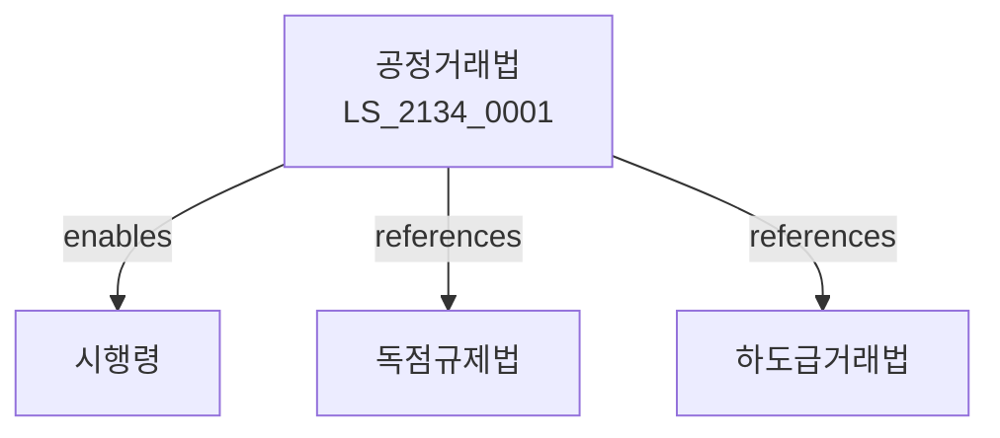

# 공정거래법

> [법률 제20194호, 2024. 1. 9., 일부개정]

---

---

## 제1장 총칙
### 제1조 (목적)
이 법은 사업자의 불공정거래행위를 방지하여 공정하고 자유로운 경쟁을 촉진함으로써 국민경제의 발전에 이바지함을 목적으로 한다。

### 제2조 (정의)
이 법에서 사용하는 용어의 뜻은 다음과 같다。
1. "사업자"란 제조ㆍ판매 등을 영업으로 하는 자를 말한다。
2. "불공정거래행위"란 공정한 거래를 저해하는 행위를 말한다。
3. "경쟁제한행위"란 경쟁을 제한하는 행위를 말한다。
4. "시장지배적지위"란 시장에서 지배적 지위를 말한다。

---

## 제2장 불공정거래행위
### 第5条(불공정거래)
불공정거래행위를 금지한다。
### 第6条(거래거절)
부당한 거래거절을 금지한다。
### 第7条(차별)
차별적 취급을 금지한다。
### 第8条(경쟁사업자배제)
경쟁사업자를 배제하는 행위를 금지한다。

---

## 제3장 시장지배적지위
### 第15条(시장지배)
시장지배적지위 남용을 금지한다。
### 第16条(지정)
시장지배적사업자를 지정한다。
### 第17条(남용금지)
남용행위를 금지한다。
### 第18条(조치)
남용행위에 대한 조치를 명한다。

---

## 제4장 기업결합
### 第25条(기업결합)
기업결합을 신고하여야 한다。
### 第26条(제한)
기업결합을 제한할 수 있다。
### 第27条(심사)
기업결합을 심사한다。
### 第28条(조건)
기업결합에 조건을 붙일 수 있다。

---

## 제5장 경쟁제한행위
### 第35条(경쟁제한)
경쟁을 제한하는 행위를 금지한다。
### 第36条(카르텔)
카르텔을 금지한다。
### 第37条(담합)
입찰담합을 금지한다。
### 第38条(가격협정)
가격협정을 금지한다。

---

## 제6장 공정거래위원회
### 第42条(공정거래위원회)
공정거래위원회를 설치한다。
### 第43条(조사)
공정거래위원회는 조사할 수 있다。
### 第44条(심판)
공정거래위원회는 심판한다。
### 第45条(조치)
공정거래위원회는 조치를 명한다。

---

## 제7장 벌칙
### 第52条(벌칙)
다음 각 호의 어느 하나에 해당하는 자는 3년 이하의 징역 또는 2억원 이하의 벌금에 처한다。

1. 카르텔을 한 자
2. 담합을 한 자
### 第53条(과징금)
다음 각 호의 어느 하나에 해당하는 자에게는 매출액의 10% 이하의 과징금을 부과한다。

1. 불공정거래를 한 자
2. 시장지배적지위를 남용한 자

---

## 관계 그래프

**상위 법령**
- [[헌법]] 제119조 (경제의 자유)
- [[독점규제법]]

**관련 법령**
- [[소비자기본법]]
- [[하도급거래법]]
- [[유통산업발전법]]
- [[독점규제법]]

**하위 법령**
- [[공정거래법 시행령]]
