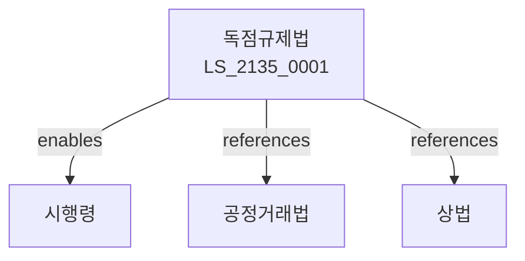

# 독점규제법

> [법률 제20195호, 2024. 1. 9., 일부개정]

---

---

## 제1장 총칙
### 제1조 (목적)
이 법은 독과점의 폐해를 방지하고 공정한 경쟁을 촉진함으로써 국민경제의 균형있는 발전에 이바지함을 목적으로 한다。

### 제2조 (정의)
이 법에서 사용하는 용어의 뜻은 다음과 같다。
1. "독점"란 시장을 지배하는 상태를 말한다。
2. "과점"란 소수 사업자가 시장을 지배하는 상태를 말한다。
3. "시장지배사업자"란 시장을 지배하는 사업자를 말한다。
4. "관련시장"란 경쟁관계에 있는 시장을 말한다。

---

## 제2장 시장지배사업자
### 第5条(시장지배사업자)
시장지배사업자를 지정한다。
### 第6条(지정기준)
시장지배사업자지정기준을 정한다。
### 第7条(남용금지)
시장지배적지위 남용을 금지한다。
### 第8条(행위유형)
남용행위유형을 정한다。

---

## 제3장 경제력집중
### 第15条(경제력집중)
경제력집중을 억제한다。
### 第16条(출자총액)
출자총액을 제한한다。
### 第17条(보유주식)
보유주식을 제한한다。
### 第18条(부채)
부채비율을 제한한다。

---

## 제4장 기업결합
### 第25条(기업결합)
기업결합을 신고하여야 한다。
### 第26条(결합제한)
기업결합을 제한할 수 있다。
### 第27条(심사)
기업결합을 심사한다。
### 第28条(구제조치)
구제조치를 명할 수 있다。

---

## 제5장 공정거래위원회
### 第35条(공정거래위원회)
공정거래위원회를 설치한다。
### 第36条(조사)
공정거래위원회는 조사할 수 있다。
### 第37条(심판)
공정거래위원회는 심판한다。
### 第38条(과징금)
공정거래위원회는 과징금을 부과한다。

---

## 제6장 감독
### 第42条(감독)
공정거래위원회는 독점규제사업을 감독한다。
### 第43条(보고 및 검사)
필요한 경우 보고를 명하거나 검사할 수 있다。
### 第44条(시정명령)
위법한 사항에 대하여는 시정을 명할 수 있다。
### 第45条(과징금)
위반사항에 대하여 과징금을 부과할 수 있다。

---

## 제7장 벌칙
### 第52条(벌칙)
다음 각 호의 어느 하나에 해당하는 자는 3년 이하의 징역 또는 2억원 이하의 벌금에 처한다。

1. 독점적 지위를 남용한 자
2. 기업결합 제한을 위반한 자
### 第53条(과징금)
다음 각 호의 어느 하나에 해당하는 자에게는 매출액의 10% 이하의 과징금을 부과한다。

1. 경제력집중 억제규정을 위반한 자
2. 기업결합 신고의무를 위반한 자

---

## 관계 그래프

**상위 법령**
- [[헌법]] 제119조 (경제의 자유)
- [[상법]]

**관련 법령**
- [[공정거래법]]
- [[하도급거래법]]
- [[소비자기본법]]
- [[유통산업발전법]]

**하위 법령**
- [[독점규제법 시행령]]
