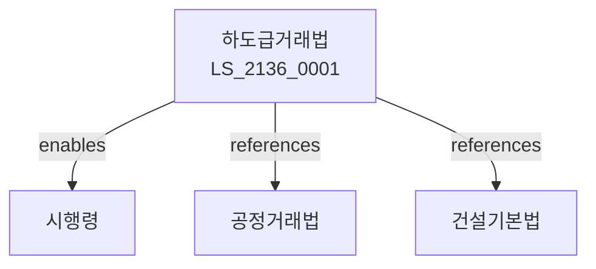

# 하도급거래법

> [법률 제20196호, 2024. 1. 9., 일부개정]

---

---

## 제1장 총칙
### 제1조 (목적)
이 법은 하도급거래에 있어서 수급사업자를 보호하여 상호협력 증진과 국민경제의 균형있는 발전에 이바지함을 목적으로 한다。

### 제2조 (정의)
이 법에서 사용하는 용어의 뜻은 다음과 같다。
1. "원사업자"란 물품의 제조 등을 위탁하는 자를 말한다。
2. "수급사업자"란 물품의 제조 등을 수탁하는 자를 말한다。
3. "하도급"란 원사업자가 수급사업자에게 위탁하는 것을 말한다。
4. "목적물"란 위탁받은 물품을 말한다。

---

## 제2장 하도급계약
### 第5条(서면계약)
하도급계약은 서면으로 체결하여야 한다。
### 第6条(계약내용)
계약내용을 명시하여야 한다。
### 第7条(계약보증)
계약보증금을 예치할 수 있다。
### 第8条(계약변경)
계약변경은 서면으로 하여야 한다。

---

## 제3장 대금지급
### 第15条(대금지급)
대금을 지급하여야 한다。
### 第16条(지급기한)
대금지급기한을 정한다。
### 第17条(지급방법)
대금지급방법을 정한다。
### 第18条(지체상금)
지체상금을 지급한다。

---

## 제4장 하도급제한
### 第25条(하도급제한)
하도급을 제한할 수 있다。
### 第26条(위탁금지)
위탁을 금지할 수 있다。
### 第27条(재위탁)
재위탁을 제한한다。
### 第28条(목적물수령)
목적물을 수령하여야 한다。

---

## 제5장 권리보호
### 第35条(권리보호)
수급사업자의 권리를 보호한다。
### 第36条(청구권)
대금청구권을 보호한다。
### 第37条(유치권)
유치권을 행사할 수 있다。
### 第38条(동시이행)
동시이행항변권을 행사할 수 있다。

---

## 제6장 감독
### 第42条(감독)
공정거래위원회는 하도급거래를 감독한다。
### 第43条(보고 및 검사)
필요한 경우 보고를 명하거나 검사할 수 있다。
### 第44条(시정명령)
위법한 사항에 대하여는 시정을 명할 수 있다。
### 第45条(과징금)
위반사항에 대하여 과징금을 부과할 수 있다。

---

## 제7장 벌칙
### 第52条(벌칙)
다음 각 호의 어느 하나에 해당하는 자는 3년 이하의 징역 또는 1억원 이하의 벌금에 처한다。

1. 대금지급을 지연한 자
2. 불이익을 준 자
### 第53条(과태료)
다음 각 호의 어느 하나에 해당하는 자에게는 5천만원 이하의 과태료를 부과한다。

1. 서면계약을 체결하지 아니한 자
2. 보고를 하지 아니한 자

---

## 관계 그래프

**상위 법령**
- [[헌법]] 제119조 (경제의 자유)
- [[공정거래법]]

**관련 법령**
- [[독점규제법]]
- [[건설기본법]]
- [[소비자기본법]]
- [[상법]]

**하위 법령**
- [[하도급거래법 시행령]]
