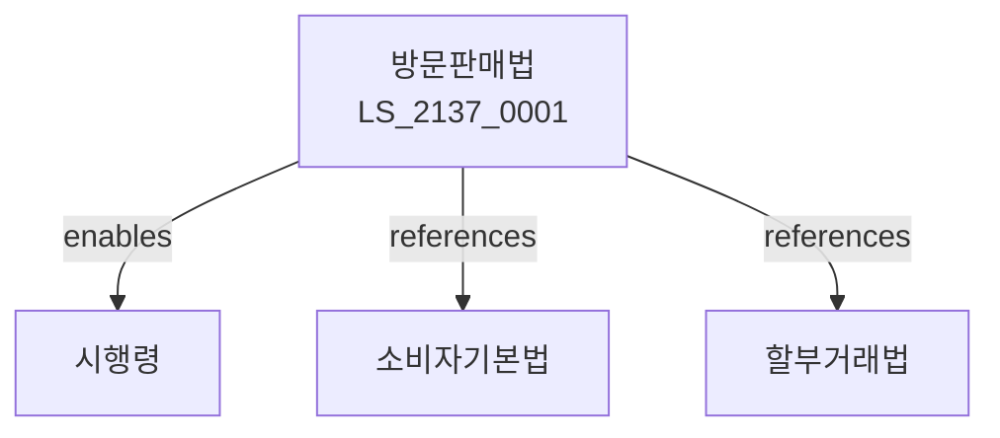

# 방문판매법

> [법률 제20197호, 2024. 1. 9., 일부개정]

---

---

## 제1장 총칙
### 제1조 (목적)
이 법은 방문판매 등에서의 소비자 보호에 관한 사항을 정함으로써 거래의 공정을 기하고 소비자 이익을 증진함을 목적으로 한다。

### 제2조 (정의)
이 법에서 사용하는 용어의 뜻은 다음과 같다。
1. "방문판매"란 사업자가 소비자를 방문하여 물품을 판매하는 것을 말한다。
2. "통신판매"란 우편 등으로 물품을 판매하는 것을 말한다。
3. "전화권유판매"란 전화로 물품을 판매하는 것을 말한다。
4. "다단계판매"란 다단계로 물품을 판매하는 것을 말한다。

---

## 제2장 방문판매
### 第5条(방문판매)
방문판매를 할 수 있다。
### 第6条(신고)
방문판매업을 신고하여야 한다。
### 第7条(계약체결)
계약을 체결할 수 있다。
### 第8条(계약서교부)
계약서를 교부하여야 한다。

---

## 제3장 청약철회
### 第15条(청약철회)
청약을 철회할 수 있다。
### 第16条(철회기간)
철회기간은 14일 이내로 한다。
### 第17条(철회효과)
철회의 효과를 정한다。
### 第18条(반환)
물품을 반환하여야 한다。

---

## 제4장 통신판매
### 第25条(통신판매)
통신판매를 할 수 있다。
### 第26条(신고)
통신판매업을 신고하여야 한다。
### 第27条(정보제공)
정보를 제공하여야 한다。
### 第28条(광고)
광고기준을 정한다。

---

## 제5장 다단계판매
### 第35条(다단계판매)
다단계판매를 할 수 있다。
### 第36条(등록)
다단계판매업을 등록하여야 한다。
### 第37条(후원수당)
후원수당을 지급할 수 있다。
### 第38条(금지행위)
금지행위를 정한다。

---

## 제6장 감독
### 第42条(감독)
공정거래위원회는 방문판매사업을 감독한다。
### 第43条(보고 및 검사)
필요한 경우 보고를 명하거나 검사할 수 있다。
### 第44条(시정명령)
위법한 사항에 대하여는 시정을 명할 수 있다。
### 第45条(영업정지)
중대한 위반사유가 있는 경우 영업정지를 명할 수 있다。

---

## 제7장 벌칙
### 第52条(벌칙)
다음 각 호의 어느 하나에 해당하는 자는 5년 이하의 징역 또는 1억원 이하의 벌금에 처한다。

1. 등록 없이 다단계판매를 한 자
2. 청약철회를 거부한 자
### 第53条(과태료)
다음 각 호의 어느 하나에 해당하는 자에게는 5천만원 이하의 과태료를 부과한다。

1. 신고를 하지 아니한 자
2. 계약서를 교부하지 아니한 자

---

## 관계 그래프

**상위 법령**
- [[헌법]] 제35조 (소비자주권)
- [[소비자기본법]]

**관련 법령**
- [[공정거래법]]
- [[할부거래법]]
- [[전자상거래법]]
- [[방송광고법]]

**하위 법령**
- [[방문판매법 시행령]]
