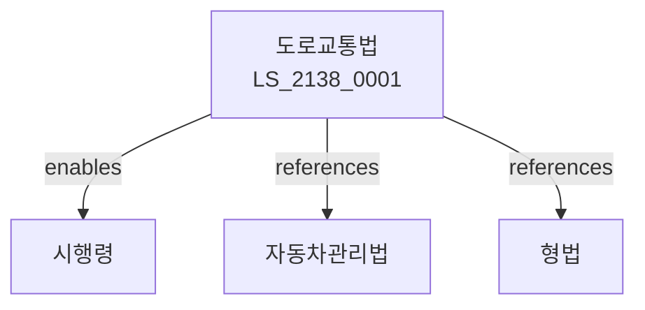

# 도로교통법

> [법률 제20198호, 2024. 1. 9., 일부개정]

---

---

## 제1장 총칙
### 제1조 (목적)
이 법은 도로에서 일어나는 교통상의 모든 위험과 장해를 방지ㆍ제거하여 안전하고 원활한 교통을 확보함을 목적으로 한다。

### 제2조 (정의)
이 법에서 사용하는 용어의 뜻은 다음과 같다。
1. "도로"란 일반교통에 제공되는 곳을 말한다。
2. "자동차"란 원동기에 의하여 구동되는 차를 말한다。
3. "운전"란 자동차를 조종하는 것을 말한다。
4. "신호기"란 교통신호를 표시하는 기기를 말한다。

---

## 제2장 보행자등
### 第5条(보행자)
보행자는 도로를 횡단할 수 있다。
### 第6条(횡단방법)
보행자는 횡단보도로 횡단하여야 한다。
### 第7条(보행자우선)
차는 보행자에게 우선권을 양보하여야 한다。
### 第8条(어린이보호)
어린이보호구역을 지정한다。

---

## 제3장 차마의 통행
### 第15条(통행방법)
차마는 우측으로 통행하여야 한다。
### 第16条(속도)
차마의 속도를 제한한다。
### 第17条(신호준수)
신호를 준수하여야 한다。
### 第18条(앞지르기)
앞지르기 방법을 정한다。

---

## 제4장 운전면허
### 第25条(운전면허)
운전면허를 취득하여야 한다。
### 第26条(면허종류)
면허종류를 정한다。
### 第27条(면허시험)
면허시험을 실시한다。
### 第28条(면허취소)
면허를 취소할 수 있다。

---

## 제5장 자동차등
### 第35条(자동차등록)
자동차를 등록하여야 한다。
### 第36条(차량검사)
자동차검사를 받아야 한다。
### 第37条(안전기준)
자동차안전기준을 정한다。
### 第38条(운행제한)
운행을 제한할 수 있다。

---

## 제6장 교통안전
### 第42条(교통안전)
교통안전을 확보한다。
### 第43条(교통안전교육)
교통안전교육을 실시한다。
### 第44条(음주운전금지)
음주운전을 금지한다。
### 第45条(과속방지)
과속을 방지한다。

---

## 제7장 벌칙
### 第52条(벌칙)
다음 각 호의 어느 하나에 해당하는 자는 5년 이하의 징역 또는 2천만원 이하의 벌금에 처한다。

1. 음주운전을 한 자
2. 무면허운전을 한 자
### 第53条(과태료)
다음 각 호의 어느 하나에 해당하는 자에게는 50만원 이하의 과태료를 부과한다。

1. 신호위반을 한 자
2. 속도위반을 한 자

---

## 관계 그래프

**상위 법령**
- [[헌법]] 제35조 (이동의 자유)
- [[형법]]

**관련 법령**
- [[자동차관리법]]
- [[운수사업법]]
- [[교통사고처리특례법]]
- [[자동차손해배상법]]

**하위 법령**
- [[도로교통법 시행령]]
