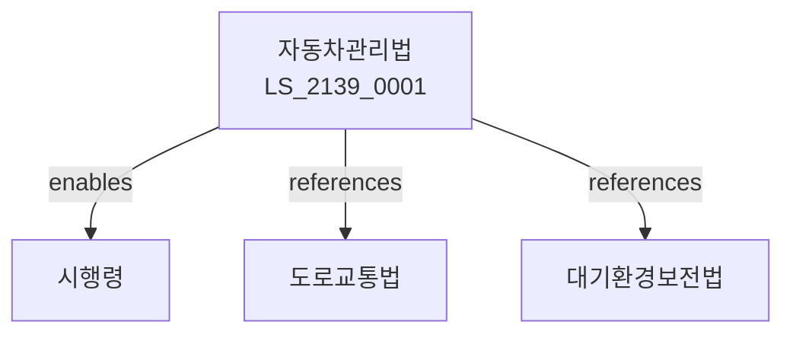

# 자동차관리법

> [법률 제20199호, 2024. 1. 9., 일부개정]

---

---

## 제1장 총칙
### 제1조 (목적)
이 법은 자동차의 등록ㆍ안전기준 및 형식승인 등에 관한 사항을 정함으로써 자동차를 적정하게 관리하고 공공복리의 증진에 이바지함을 목적으로 한다。

### 제2조 (정의)
이 법에서 사용하는 용어의 뜻은 다음과 같다。
1. "자동차"란 원동기에 의하여 구동되는 차를 말한다。
2. "자동차등록"란 자동차를 등록하는 것을 말한다。
3. "형식승인"란 자동차형식에 대한 승인을 말한다。
4. "자동차검사"란 자동차를 검사하는 것을 말한다。

---

## 제2장 자동차등록
### 第5条(자동차등록)
자동차를 등록하여야 한다。
### 第6条(등록원부)
자동차등록원부를 비치한다。
### 第7条(등록사항)
등록사항을 정한다。
### 第8条(변경등록)
변경등록을 하여야 한다。

---

## 제3장 자동차검사
### 第15条(정기검사)
자동차정기검사를 받아야 한다。
### 第16条(구조변경)
구조변경검사를 받아야 한다。
### 第17条(검사기관)
검사기관을 지정한다。
### 第18条(검사기준)
검사기준을 정한다。

---

## 제4장 형식승인
### 第25条(형식승인)
자동차형식승인을 받아야 한다。
### 第26条(승인신청)
형식승인을 신청한다。
### 第27条(승인기준)
형식승인기준을 정한다。
### 第28条(승인면제)
형식승인을 면제할 수 있다。

---

## 제5장 안전기준
### 第35条(안전기준)
자동차안전기준을 정한다。
### 第36条(배출가스)
배출가스허용기준을 정한다。
### 第37条(소음기준)
소음허용기준을 정한다。
### 第38条(연비기준)
연비기준을 정한다。

---

## 제6장 감독
### 第42条(감독)
국토교통부장관은 자동차관리사업을 감독한다。
### 第43条(보고 및 검사)
필요한 경우 보고를 명하거나 검사할 수 있다。
### 第44条(시정명령)
위법한 사항에 대하여는 시정을 명할 수 있다。
### 第45条(영업정지)
중대한 위반사유가 있는 경우 영업정지를 명할 수 있다。

---

## 제7장 벌칙
### 第52条(벌칙)
다음 각 호의 어느 하나에 해당하는 자는 3년 이하의 징역 또는 3천만원 이하의 벌금에 처한다。

1. 등록 없이 자동차를 운행한 자
2. 형식승인 없이 제조한 자
### 第53条(과태료)
다음 각 호의 어느 하나에 해당하는 자에게는 2천만원 이하의 과태료를 부과한다。

1. 검사를 받지 아니한 자
2. 보고를 하지 아니한 자

---

## 관계 그래프

**상위 법령**
- [[헌법]] 제35조 (이동의 자유)
- [[도로교통법]]

**관련 법령**
- [[운수사업법]]
- [[대기환경보전법]]
- [[자동차손해배상법]]
- [[교통사고처리특례법]]

**하위 법령**
- [[자동차관리법 시행령]]
