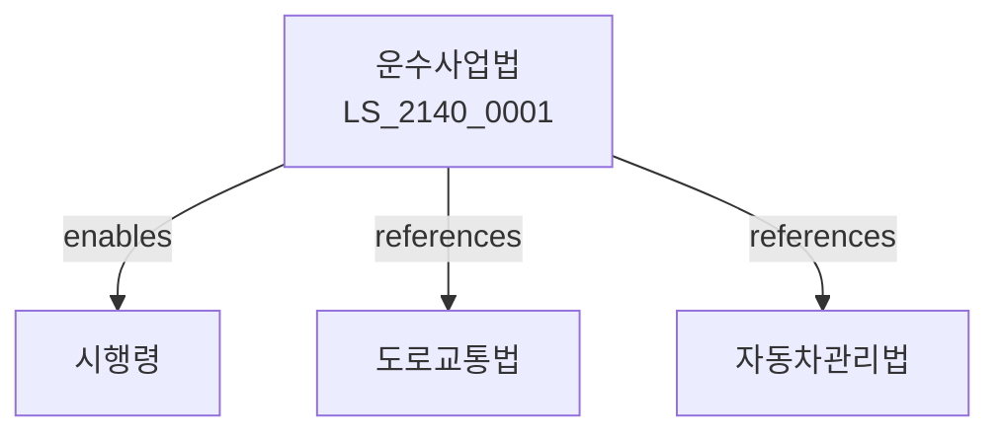

# 운수사업법

> [법률 제20200호, 2024. 1. 9., 일부개정]

---

---

## 제1장 총칙
### 제1조 (목적)
이 법은 여객자동차운수사업 및 화물자동차운수사업의 건전한 발전을 도모하여 국민교통의 편익과 공공복리의 증진에 이바지함을 목적으로 한다。

### 제2조 (정의)
이 법에서 사용하는 용어의 뜻은 다음과 같다。
1. "여객자동차"란 여객을 운송하는 자동차를 말한다。
2. "화물자동차"란 화물을 운송하는 자동차를 말한다。
3. "운수사업"란 운송사업을 말한다。
4. "면허"란 운수사업면허를 말한다。

---

## 제2장 여객자동차운수사업
### 第5条(사업면허)
여객자동차운수사업 면허를 받아야 한다。
### 第6条(면허기준)
면허기준을 정한다。
### 第7条(운송책임)
운송책임을 진다。
### 第8条(운임)
운임을 신고하여야 한다。

---

## 제3장 화물자동차운수사업
### 第15条(사업등록)
화물자동차운수사업을 등록하여야 한다。
### 第16条(등록기준)
등록기준을 정한다。
### 第17条(운송의무)
운송의무를 진다。
### 第18条(운임)
운임을 신고하여야 한다。

---

## 제4장 택시사업
### 第25条(택시사업)
택시운수사업을 할 수 있다。
### 第26条(택시면허)
택시면허를 받아야 한다。
### 第27条(택시요금)
택시요금을 신고한다。
### 第28条(택시운행)
택시운행기준을 정한다。

---

## 제5장 버스사업
### 第35条(버스사업)
버스운수사업을 할 수 있다。
### 第36条(버스면허)
버스면허를 받아야 한다。
### 第37条(노선지정)
노선을 지정한다。
### 第38条(배차간격)
배차간격을 정한다。

---

## 제6장 감독
### 第42条(감독)
국토교통부장관은 운수사업을 감독한다。
### 第43条(보고 및 검사)
필요한 경우 보고를 명하거나 검사할 수 있다。
### 第44条(시정명령)
위법한 사항에 대하여는 시정을 명할 수 있다。
### 第45条(영업정지)
중대한 위반사유가 있는 경우 영업정지를 명할 수 있다。

---

## 제7장 벌칙
### 第52条(벌칙)
다음 각 호의 어느 하나에 해당하는 자는 3년 이하의 징역 또는 3천만원 이하의 벌금에 처한다。

1. 면허 없이 운수사업을 영위한 자
2. 등록 없이 운수사업을 영위한 자
### 第53条(과태료)
다음 각 호의 어느 하나에 해당하는 자에게는 2천만원 이하의 과태료를 부과한다。

1. 보고를 하지 아니한 자
2. 검사를 거부한 자

---

## 관계 그래프

**상위 법령**
- [[헌법]] 제35조 (이동의 자유)
- [[도로교통법]]

**관련 법령**
- [[자동차관리법]]
- [[물류정책기본법]]
- [[여객자동차운수사업법]]
- [[화물자동차운수사업법]]

**하위 법령**
- [[운수사업법 시행령]]
