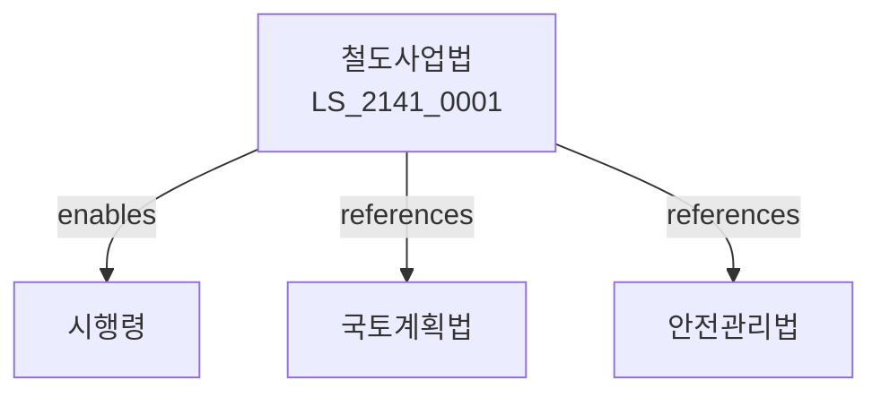

# 철도사업법

> [법률 제20201호, 2024. 1. 9., 일부개정]

---

---

## 제1장 총칙
### 제1조 (목적)
이 법은 철도사업의 건전한 발전과 철도의 안전운행을 확보함으로써 국민교통의 편익과 국가경제의 발전에 이바지함을 목적으로 한다。

### 제2조 (정의)
이 법에서 사용하는 용어의 뜻은 다음과 같다。
1. "철도"란 궤도에 의하여 운송하는 시설을 말한다。
2. "철도사업"란 철도운송사업을 말한다。
3. "철도시설"란 철도의 시설을 말한다。
4. "운전사업"란 철도운전사업을 말한다。

---

## 제2장 철도사업면허
### 第5条(사업면허)
철도사업 면허를 받아야 한다。
### 第6条(면허종류)
면허종류를 정한다。
### 第7条(면허기준)
면허기준을 정한다。
### 第8条(면허취소)
면허를 취소할 수 있다。

---

## 제3장 철도시설
### 第15条(철도시설)
철도시설을 설치한다。
### 第16条(건설기준)
건설기준을 정한다。
### 第17条(유지관리)
유지관리를 한다。
### 第18条(안전점검)
안전점검을 실시한다。

---

## 제4장 철도운영
### 第25条(운영)
철도를 운영한다。
### 第26条(운행계획)
운행계획을 수립한다。
### 第27条(운임)
운임을 신고한다。
### 第28条(수송의무)
수송의무를 진다。

---

## 제5장 철도안전
### 第35条(철도안전)
철도안전을 확보한다。
### 第36条(안전관리)
안전관리체계를 구축한다。
### 第37条(사고예방)
사고를 예방한다。
### 第38条(비상대비)
비상대비계획을 수립한다。

---

## 제6장 감독
### 第42条(감독)
국토교통부장관은 철도사업을 감독한다。
### 第43条(보고 및 검사)
필요한 경우 보고를 명하거나 검사할 수 있다。
### 第44条(시정명령)
위법한 사항에 대하여는 시정을 명할 수 있다。
### 第45条(영업정지)
중대한 위반사유가 있는 경우 영업정지를 명할 수 있다。

---

## 제7장 벌칙
### 第52条(벌칙)
다음 각 호의 어느 하나에 해당하는 자는 5년 이하의 징역 또는 5천만원 이하의 벌금에 처한다。

1. 면허 없이 철도사업을 영위한 자
2. 안전기준을 위반한 자
### 第53条(과태료)
다음 각 호의 어느 하나에 해당하는 자에게는 3천만원 이하의 과태료를 부과한다。

1. 보고를 하지 아니한 자
2. 검사를 거부한 자

---

## 관계 그래프

**상위 법령**
- [[헌법]] 제35조 (이동의 자유)
- [[교통안전법]]

**관련 법령**
- [[국토계획법]]
- [[도로교통법]]
- [[도시철도법]]
- [[물류정책기본법]]

**하위 법령**
- [[철도사업법 시행령]]
