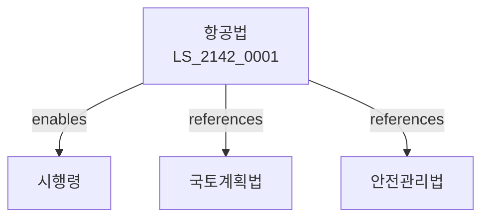

# 항공법

> [법률 제20202호, 2024. 1. 9., 일부개정]

---

---

## 제1장 총칙
### 제1조 (목적)
이 법은 항공사업의 건전한 발전과 항공기의 안전운항을 확보함으로써 국민교통의 편익과 국가경제의 발전에 이바지함을 목적으로 한다。

### 제2조 (정의)
이 법에서 사용하는 용어의 뜻은 다음과 같다。
1. "항공기"란 비행기 등을 말한다。
2. "항공사업"란 항공운송사업을 말한다。
3. "공항"란 항공기의 이착륙시설을 말한다。
4. "운항"란 항공기를 운전하는 것을 말한다。

---

## 제2장 항공기등록
### 第5条(항공기등록)
항공기를 등록하여야 한다。
### 第6条(국적표시)
국적표시를 하여야 한다。
### 第7条(등록원부)
등록원부를 비치한다。
### 第8条(등록변경)
등록변경을 하여야 한다。

---

## 제3장 항공사업
### 第15条(사업면허)
항공사업 면허를 받아야 한다。
### 第16条(면허종류)
면허종류를 정한다。
### 第17条(운임)
운임을 신고한다。
### 第18条(수송의무)
수송의무를 진다。

---

## 제4장 공항
### 第25条(공항지정)
공항을 지정한다。
### 第26条(공항시설)
공항시설을 설치한다。
### 第27条(공항운영)
공항을 운영한다。
### 第28条(공항사용료)
공항사용료를 징수한다。

---

## 제5장 항공안전
### 第35条(항공안전)
항공안전을 확보한다。
### 第36条(정기검사)
정기검사를 실시한다。
### 第37条(운항승인)
운항승인을 받아야 한다。
### 第38条(사고조사)
사고조사를 실시한다。

---

## 제6장 항공보안
### 第42条(항공보안)
항공보안을 확보한다。
### 第43条(보안검색)
보안검색을 실시한다。
### 第44条(위험물금지)
위험물 반입을 금지한다。
### 第45条(테러방지)
테러방지대책을 수립한다。

---

## 제7장 감독
### 第52条(감독)
국토교통부장관은 항공사업을 감독한다。
### 第53条(보고 및 검사)
필요한 경우 보고를 명하거나 검사할 수 있다。
### 第54条(시정명령)
위법한 사항에 대하여는 시정을 명할 수 있다。
### 第55条(영업정지)
중대한 위반사유가 있는 경우 영업정지를 명할 수 있다。

---

## 제8장 벌칙
### 第62条(벌칙)
다음 각 호의 어느 하나에 해당하는 자는 5년 이하의 징역 또는 5천만원 이하의 벌금에 처한다。

1. 면허 없이 항공사업을 영위한 자
2. 안전기준을 위반한 자
### 第63条(과태료)
다음 각 호의 어느 하나에 해당하는 자에게는 3천만원 이하의 과태료를 부과한다。

1. 보고를 하지 아니한 자
2. 검사를 거부한 자

---

## 관계 그래프

**상위 법령**
- [[헌법]] 제35조 (이동의 자유)
- [[교통안전법]]

**관련 법령**
- [[국토계획법]]
- [[철도사업법]]
- [[물류정책기본법]]
- [[국제항공법]]

**하위 법령**
- [[항공법 시행령]]
