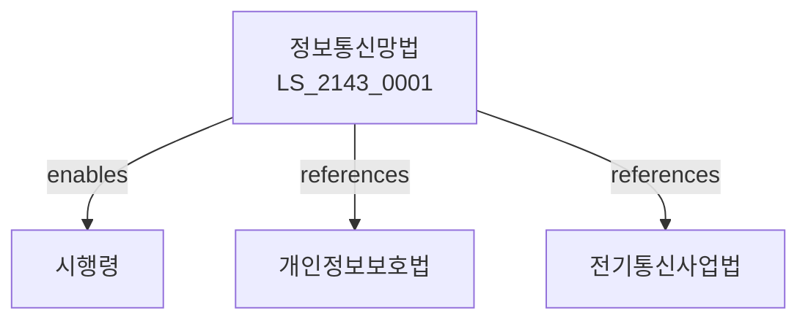

# 정보통신망법

> [법률 제20203호, 2024. 1. 9., 일부개정]

---

---

## 제1장 총칙
### 제1조 (목적)
이 법은 정보통신망의 이용촉진 및 정보의 흐름을 원활하게 함으로써 국민생활의 향상과 공공복리의 증진에 이바지함을 목적으로 한다。

### 제2조 (정의)
이 법에서 사용하는 용어의 뜻은 다음과 같다。
1. "정보통신망"란 정보를 통신하는 망을 말한다。
2. "정보통신서비스"란 정보통신망을 이용한 서비스를 말한다。
3. "이용자"란 정보통신서비스를 이용하는 자를 말한다。
4. "정보"란 사실ㆍ지식 등을 말한다。

---

## 제2장 정보통신망의 이용
### 第5条(이용자)
정보통신망을 이용할 수 있다。
### 第6条(이용자보호)
이용자를 보호한다。
### 第7条(접근권)
정보통신망에 접근할 권리를 가진다。
### 第8条(이용제한)
이용을 제한할 수 있다。

---

## 제3장 정보의 보호
### 第15条(정보보호)
정보를 보호한다。
### 第16条(개인정보)
개인정보를 보호한다。
### 第17条(비밀)
통신비밀을 보호한다。
### 第18条(보안)
정보보안을 확보한다。

---

## 제4장 정보통신서비스
### 第25条(서비스)
정보통신서비스를 제공한다。
### 第26条(이용계약)
이용계약을 체결한다。
### 第27条(이용료)
이용료를 부과한다。
### 第28条(서비스중단)
서비스를 중단할 수 있다。

---

## 제5장 불법정보
### 第35条(불법정보)
불법정보의 유통을 방지한다。
### 第36条(삭제)
불법정보를 삭제할 수 있다。
### 第37条(차단)
불법정보를 차단할 수 있다。
### 第38条(신고)
불법정보를 신고할 수 있다。

---

## 제6장 감독
### 第42条(감독)
과학기술정보통신부장관은 정보통신사업을 감독한다。
### 第43条(보고 및 검사)
필요한 경우 보고를 명하거나 검사할 수 있다。
### 第44条(시정명령)
위법한 사항에 대하여는 시정을 명할 수 있다。
### 第45条(과징금)
위반사항에 대하여 과징금을 부과할 수 있다。

---

## 제7장 벌칙
### 第52条(벌칙)
다음 각 호의 어느 하나에 해당하는 자는 5년 이하의 징역 또는 5천만원 이하의 벌금에 처한다。

1. 개인정보를 유출한 자
2. 불법정보를 유통한 자
### 第53条(과태료)
다음 각 호의 어느 하나에 해당하는 자에게는 3천만원 이하의 과태료를 부과한다。

1. 보고를 하지 아니한 자
2. 검사를 거부한 자

---

## 관계 그래프

**상위 법령**
- [[헌법]] 제18조 (통신의 자유)
- [[개인정보보호법]]

**관련 법령**
- [[전기통신사업법]]
- [[전자거래법]]
- [[정보통신기본법]]
- [[사이버안전법]]

**하위 법령**
- [[정보통신망법 시행령]]
