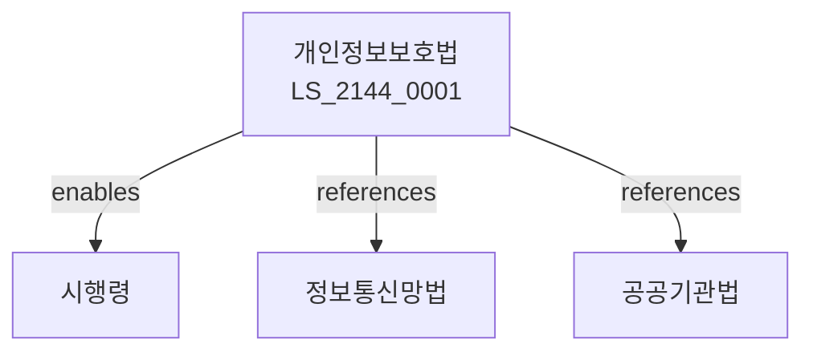

# 개인정보보호법

> [법률 제20204호, 2024. 1. 9., 일부개정]

---

---

## 제1장 총칙
### 제1조 (목적)
이 법은 개인정보의 수집ㆍ이용 및 제공에 관한 사항을 정함으로써 개인의 자유와 권리를 보호하고 국민의 기본권을 향상함을 목적으로 한다。

### 제2조 (정의)
이 법에서 사용하는 용어의 뜻은 다음과 같다。
1. "개인정보"란 생존하는 개인의 정보를 말한다。
2. "정보주체"란 개인정보의 주체를 말한다。
3. "정보처리자"란 개인정보를 처리하는 자를 말한다。
4. "처리"란 수집ㆍ이용 등을 말한다。

---

## 제2장 개인정보의 수집
### 第5条(수집원칙)
개인정보는 적법하게 수집하여야 한다。
### 第6条(수집제한)
최소한의 정보를 수집하여야 한다。
### 第7条(동의)
정보주체의 동의를 받아야 한다。
### 第8条(법적근거)
법적근거에 따라 수집할 수 있다。

---

## 제3장 개인정보의 이용
### 第15条(이용원칙)
수집목적 내에서 이용하여야 한다。
### 第16条(이용제한)
목적 외 이용을 제한한다。
### 第17条(제3자제공)
제3자 제공을 제한한다。
### 第18条(안전성)
안전성을 확보하여야 한다。

---

## 제4장 개인정보의 보호
### 第25条(보호조치)
보호조치를 하여야 한다。
### 第26条(기술적조치)
기술적 조치를 하여야 한다。
### 第27条(관리적조치)
관리적 조치를 하여야 한다。
### 第28条(물리적조치)
물리적 조치를 하여야 한다。

---

## 제5장 개인정보의 파기
### 第35条(파기원칙)
보유기간 경과 시 파기하여야 한다。
### 第36条(파기방법)
파기방법을 정한다。
### 第37条(파기기록)
파기기록을 유지한다。
### 第38条(파기예외)
파기 예외를 정한다。

---

## 제6장 정보주체의 권리
### 第42条(권리)
정보주체는 권리를 가진다。
### 第43条(열람)
열람을 요구할 수 있다。
### 第44条(정정)
정정을 요구할 수 있다。
### 第45条(삭제)
삭제를 요구할 수 있다。

---

## 제7장 개인정보보호위원회
### 第52条(위원회)
개인정보보호위원회를 설치한다。
### 第53条(조사)
위원회는 조사할 수 있다。
### 第54条(조치)
위원회는 조치를 명할 수 있다。
### 第55条(과징금)
위원회는 과징금을 부과할 수 있다。

---

## 제8장 벌칙
### 第62条(벌칙)
다음 각 호의 어느 하나에 해당하는 자는 5년 이하의 징역 또는 5천만원 이하의 벌금에 처한다。

1. 개인정보를 유출한 자
2. 부당하게 수집한 자
### 第63条(과태료)
다음 각 호의 어느 하나에 해당하는 자에게는 5천만원 이하의 과태료를 부과한다。

1. 열람을 거부한 자
2. 보고를 하지 아니한 자

---

## 관계 그래프

**상위 법령**
- [[헌법]] 제17조 (사생활의 자유)
- [[민법]]

**관련 법령**
- [[정보통신망법]]
- [[전기통신사업법]]
- [[공공기관법]]
- [[사이버안전법]]

**하위 법령**
- [[개인정보보호법 시행령]]
