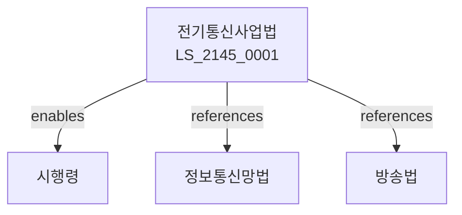

# 전기통신사업법

> [법률 제20205호, 2024. 1. 9., 일부개정]

---

---

## 제1장 총칙
### 제1조 (목적)
이 법은 전기통신사업의 건전한 발전과 전기통신역무의 원활한 제공을 도모함으로써 공공복리의 증진에 이바지함을 목적으로 한다。

### 제2조 (정의)
이 법에서 사용하는 용어의 뜻은 다음과 같다。
1. "전기통신"란 전기에 의한 통신을 말한다。
2. "전기통신사업"란 전기통신역무를 제공하는 사업을 말한다。
3. "전기통신설비"란 전기통신을 위한 설비를 말한다。
4. "역무"란 전기통신서비스를 말한다。

---

## 제2장 전기통신사업
### 第5条(사업등록)
전기통신사업을 등록하여야 한다。
### 第6条(등록기준)
등록기준을 정한다。
### 第7条(양도양수)
사업을 양도할 수 있다。
### 第8条(영업양도)
영업을 양도할 수 있다。

---

## 제3장 전기통신역무
### 第15条(역무제공)
역무를 제공하여야 한다。
### 第16条(역무이용)
역무를 이용할 수 있다。
### 第17条(약관)
약관을 신고하여야 한다。
### 第18条(이용료)
이용료를 신고한다。

---

## 제4장 전기통신설비
### 第25条(설비기준)
설비기준을 정한다。
### 第26条(설비설치)
설비를 설치한다。
### 第27条(설비유지)
설비를 유지한다。
### 第28条(설비검사)
설비검사를 받아야 한다。

---

## 제5장 상호접속
### 第35条(접속)
상호접속을 하여야 한다。
### 第36条(접속협의)
접속협의를 한다。
### 第37条(접속료)
접속료를 정한다。
### 第38条(분쟁조정)
접속분쟁을 조정한다。

---

## 제6장 보편적역무
### 第42条(보편적역무)
보편적역무를 제공한다。
### 第43条(제공대상)
제공대상을 정한다。
### 第44条(제공지역)
제공지역을 정한다。
### 第45条(비용분담)
비용을 분담한다。

---

## 제7장 감독
### 第52条(감독)
과학기술정보통신부장관은 전기통신사업을 감독한다。
### 第53条(보고 및 검사)
필요한 경우 보고를 명하거나 검사할 수 있다。
### 第54条(시정명령)
위법한 사항에 대하여는 시정을 명할 수 있다。
### 第55条(영업정지)
중대한 위반사유가 있는 경우 영업정지를 명할 수 있다。

---

## 제8장 벌칙
### 第62条(벌칙)
다음 각 호의 어느 하나에 해당하는 자는 3년 이하의 징역 또는 2억원 이하의 벌금에 처한다。

1. 등록 없이 사업을 영위한 자
2. 약관 위반을 한 자
### 第63条(과태료)
다음 각 호의 어느 하나에 해당하는 자에게는 3천만원 이하의 과태료를 부과한다。

1. 보고를 하지 아니한 자
2. 검사를 거부한 자

---

## 관계 그래프

**상위 법령**
- [[헌법]] 제18조 (통신의 자유)
- [[정보통신망법]]

**관련 법령**
- [[방송법]]
- [[개인정보보호법]]
- [[정보통신기본법]]
- [[전파법]]

**하위 법령**
- [[전기통신사업법 시행령]]
