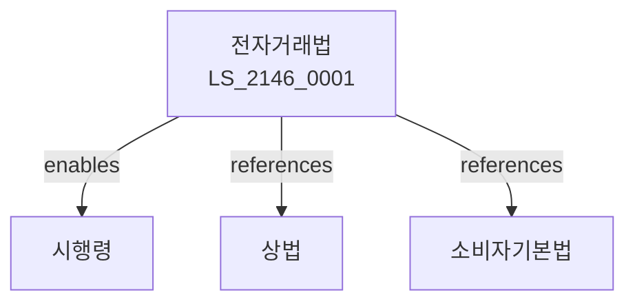

# 전자거래법

> [법률 제20206호, 2024. 1. 9., 일부개정]

---

---

## 제1장 총칙
### 제1조 (목적)
이 법은 전자거래의 안전성과 신뢰성을 확보함으로써 국민경제의 발전과 소비자 보호에 이바지함을 목적으로 한다。

### 제2조 (정의)
이 법에서 사용하는 용어의 뜻은 다음과 같다。
1. "전자거래"란 전자적 방식으로 재화나 용역을 거래하는 것을 말한다。
2. "전자문서"란 전자적 방식으로 작성된 문서를 말한다。
3. "전자서명"란 전자적 방식으로 서명하는 것을 말한다。
4. "사이버몰"란 인터넷 쇼핑몰을 말한다。

---

## 제2장 전자거래당사자
### 第5条(당사자)
전자거래당사자를 정한다。
### 第6条(전자상인)
전자상인의 의무를 정한다。
### 第7条(소비자)
소비자의 권리를 보호한다。
### 第8条(영업소)
영업소를 표시하여야 한다。

---

## 제3장 전자거래계약
### 第15条(계약체결)
전자거래계약을 체결할 수 있다。
### 第16条(청약)
청약을 할 수 있다。
### 第17条(승낙)
승낙을 하여야 한다。
### 第18条(계약성립)
계약성립시기를 정한다。

---

## 제4장 전자거래안전
### 第25条(안전성)
전자거래의 안전성을 확보한다。
### 第26条(암호화)
암호화를 할 수 있다。
### 第27条(인증)
인증을 받을 수 있다。
### 第28条(보안)
보안을 확보한다。

---

## 제5장 전자서명
### 第35条(전자서명)
전자서명을 할 수 있다。
### 第36条(효력)
전자서명의 효력을 정한다。
### 第37条(인증기관)
인증기관을 지정한다。
### 第38条(인증서)
인증서를 발급한다。

---

## 제6장 감독
### 第42条(감독)
산업통상자원부장관은 전자거래사업을 감독한다。
### 第43条(보고 및 검사)
필요한 경우 보고를 명하거나 검사할 수 있다。
### 第44条(시정명령)
위법한 사항에 대하여는 시정을 명할 수 있다。
### 第45条(영업정지)
중대한 위반사유가 있는 경우 영업정지를 명할 수 있다。

---

## 제7장 벌칙
### 第52条(벌칙)
다음 각 호의 어느 하나에 해당하는 자는 5년 이하의 징역 또는 5천만원 이하의 벌금에 처한다。

1. 사기 목적 전자거래를 한 자
2. 위조 전자서명을 한 자
### 第53条(과태료)
다음 각 호의 어느 하나에 해당하는 자에게는 3천만원 이하의 과태료를 부과한다。

1. 보고를 하지 아니한 자
2. 검사를 거부한 자

---

## 관계 그래프

**상위 법령**
- [[헌법]] 제119조 (경제의 자유)
- [[상법]]

**관련 법령**
- [[소비자기본법]]
- [[정보통신망법]]
- [[전자서명법]]
- [[전기통신사업법]]

**하위 법령**
- [[전자거래법 시행령]]
