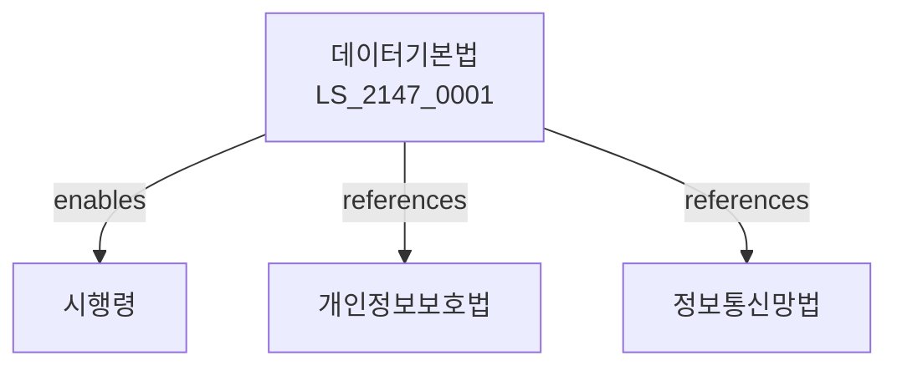

# 데이터기본법

> [법률 제20207호, 2024. 1. 9., 일부개정]

---

---

## 제1장 총칙
### 제1조 (목적)
이 법은 데이터의 생산ㆍ유통 및 활용에 관한 기본적인 사항을 정함으로써 데이터경제의 발전과 국민의 삶의 질 향상에 이바지함을 목적으로 한다。

### 제2조 (정의)
이 법에서 사용하는 용어의 뜻은 다음과 같다。
1. "데이터"란 사실ㆍ정보 등을 말한다。
2. "데이터사업"란 데이터를 제공하는 사업을 말한다。
3. "데이터거래"란 데이터를 거래하는 것을 말한다。
4. "데이터주권"란 데이터에 대한 권리를 말한다。

---

## 제2장 데이터기본계획
### 第5条(기본계획)
데이터기본계획을 수립한다。
### 第6条(시행계획)
시행계획을 수립한다。
### 第7条(데이터진흥)
데이터산업을 진흥한다。
### 第8条(혁신)
데이터혁신을 도모한다。

---

## 제3장 데이터거래
### 第15条(데이터거래)
데이터를 거래할 수 있다。
### 第16条(거래소)
데이터거래소를 설치한다。
### 第17条(거래원칙)
거래원칙을 정한다。
### 第18条(거래안전)
거래안전을 확보한다。

---

## 제4장 데이터주권
### 第25条(데이터주권)
데이터주권을 보장한다。
### 第26条(주권침해)
주권침해를 방지한다。
### 第27条(국외이전)
국외이전을 제한한다。
### 第28条(보호)
데이터를 보호한다。

---

## 제5장 데이터활용
### 第35条(데이터활용)
데이터를 활용한다。
### 第36条(공공데이터)
공공데이터를 개방한다。
### 第37条(민간데이터)
민간데이터를 활성화한다。
### 第38条(빅데이터)
빅데이터를 활용한다。

---

## 제6장 감독
### 第42条(감독)
과학기술정보통신부장관은 데이터사업을 감독한다。
### 第43条(보고 및 검사)
필요한 경우 보고를 명하거나 검사할 수 있다。
### 第44条(시정명령)
위법한 사항에 대하여는 시정을 명할 수 있다。
### 第45条(과징금)
위반사항에 대하여 과징금을 부과할 수 있다。

---

## 제7장 벌칙
### 第52条(벌칙)
다음 각 호의 어느 하나에 해당하는 자는 3년 이하의 징역 또는 3천만원 이하의 벌금에 처한다。

1. 데이터를 부당하게 이용한 자
2. 거래질서를 문란하게 한 자
### 第53条(과태료)
다음 각 호의 어느 하나에 해당하는 자에게는 2천만원 이하의 과태료를 부과한다。

1. 보고를 하지 아니한 자
2. 검사를 거부한 자

---

## 관계 그래프

**상위 법령**
- [[헌법]] 제10조 (행복추구권)
- [[개인정보보호법]]

**관련 법령**
- [[정보통신망법]]
- [[전기통신사업법]]
- [[전자거래법]]
- [[지식재산권법]]

**하위 법령**
- [[데이터기본법 시행령]]
