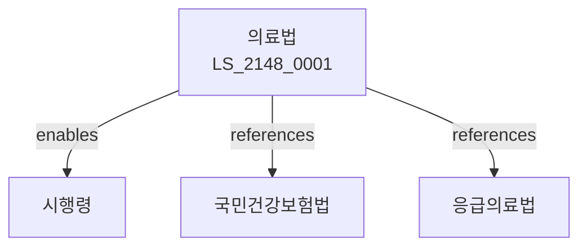

# 의료법

> [법률 제20208호, 2024. 1. 9., 일부개정]

---

---

## 제1장 총칙
### 제1조 (목적)
이 법은 의료를 제공하는 시설과 종사자 등에 관한 사항을 정함으로써 국민의 건강을 보호하고 증진함을 목적으로 한다。

### 제2조 (정의)
이 법에서 사용하는 용어의 뜻은 다음과 같다。
1. "의료"란 질병의 예방ㆍ진단 및 치료를 말한다。
2. "의료인"란 의사ㆍ치과의사 등을 말한다。
3. "의료기관"란 의료를 제공하는 시설을 말한다。
4. "환자"란 의료를 필요로 하는 자를 말한다。

---

## 제2장 의료기관
### 第5条(의료기관)
의료기관을 개설할 수 있다。
### 第6条(허가)
의료기관 허가를 받아야 한다。
### 第7条(시설기준)
시설기준을 정한다。
### 第8条(개설폐지)
개설폐지를 신고하여야 한다。

---

## 제3장 의료인
### 第15条(의료인)
의료인이 될 수 있다。
### 第16条(면허)
의료인 면허를 받아야 한다。
### 第17条(의무)
의료인의 의무를 정한다。
### 第18条(보수교육)
보수교육을 받아야 한다。

---

## 제4장 의료행위
### 第25条(진료)
진료를 할 수 있다。
### 第26条(진단)
진단을 할 수 있다。
### 第27条(치료)
치료를 할 수 있다。
### 第28条(처방)
처방을 할 수 있다。

---

## 제5장 의료기기
### 第35条(의료기기)
의료기기를 사용할 수 있다。
### 第36条(제조)
의료기기를 제조할 수 있다。
### 第37条(수입)
의료기기를 수입할 수 있다。
### 第38条(품목허가)
품목허가를 받아야 한다。

---

## 제6장 감독
### 第42条(감독)
보건복지부장관은 의료사업을 감독한다。
### 第43条(보고 및 검사)
필요한 경우 보고를 명하거나 검사할 수 있다。
### 第44条(시정명령)
위법한 사항에 대하여는 시정을 명할 수 있다。
### 第45条(영업정지)
중대한 위반사유가 있는 경우 영업정지를 명할 수 있다。

---

## 제7장 벌칙
### 第52条(벌칙)
다음 각 호의 어느 하나에 해당하는 자는 5년 이하의 징역 또는 5천만원 이하의 벌금에 처한다。

1. 면허 없이 의료행위를 한 자
2. 허가 없이 의료기관을 개설한 자
### 第53条(과태료)
다음 각 호의 어느 하나에 해당하는 자에게는 3천만원 이하의 과태료를 부과한다。

1. 보고를 하지 아니한 자
2. 검사를 거부한 자

---

## 관계 그래프

**상위 법령**
- [[헌법]] 제36조 (국민의 건강)
- [[국민건강보험법]]

**관련 법령**
- [[약사법]]
- [[응급의료법]]
- [[감염병예방법]]
- [[의료기사법]]

**하위 법령**
- [[의료법 시행령]]
