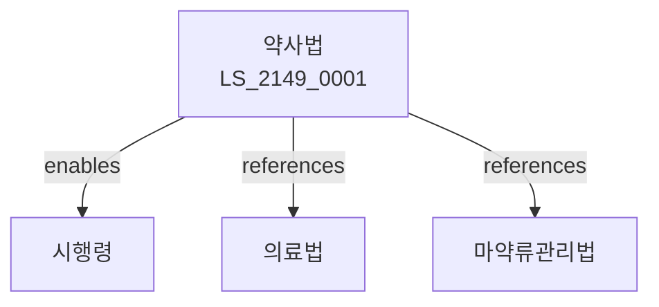

# 약사법

> [법률 제20209호, 2024. 1. 9., 일부개정]

---

---

## 제1장 총칙
### 제1조 (목적)
이 법은 약사 및 약품에 관한 사항을 정함으로써 국민의 건강을 보호하고 증진함을 목적으로 한다。

### 제2조 (정의)
이 법에서 사용하는 용어의 뜻은 다음과 같다。
1. "약사"란 약제사를 말한다。
2. "약품"란 의약품을 말한다。
3. "의약품"란 질병의 치료 등에 사용하는 물품을 말한다。
4. "조제"란 약품을 조제하는 것을 말한다。

---

## 제2장 약사
### 第5条(약사)
약사가 될 수 있다。
### 第6条(면허)
약사면허를 받아야 한다。
### 第7条(의무)
약사의 의무를 정한다。
### 第8条(보수교육)
보수교육을 받아야 한다。

---

## 제3장 약국
### 第15条(약국)
약국을 개설할 수 있다。
### 第16条(개설등록)
약국개설등록을 하여야 한다。
### 第17条(약국관리)
약국을 관리한다。
### 第18条(폐쇄)
약국을 폐쇄할 수 있다。

---

## 제4장 의약품
### 第25条(의약품)
의약품을 제조할 수 있다。
### 第26条(제조허가)
제조허가를 받아야 한다。
### 第27条(품목허가)
품목허가를 받아야 한다。
### 第28条(수입)
의약품을 수입할 수 있다。

---

## 제5장 의약품판매
### 第35条(판매)
의약품을 판매할 수 있다。
### 第36条(판매업)
판매업을 등록하여야 한다。
### 第37条(광고)
광고를 제한한다。
### 第38条(표시)
표시를 하여야 한다。

---

## 제6장 감독
### 第42条(감독)
보건복지부장관은 약사사업을 감독한다。
### 第43条(보고 및 검사)
필요한 경우 보고를 명하거나 검사할 수 있다。
### 第44条(시정명령)
위법한 사항에 대하여는 시정을 명할 수 있다。
### 第45条(영업정지)
중대한 위반사유가 있는 경우 영업정지를 명할 수 있다。

---

## 제7장 벌칙
### 第52条(벌칙)
다음 각 호의 어느 하나에 해당하는 자는 5년 이하의 징역 또는 5천만원 이하의 벌금에 처한다。

1. 면허 없이 약사업무를 한 자
2. 허가 없이 의약품을 제조한 자
### 第53条(과태료)
다음 각 호의 어느 하나에 해당하는 자에게는 3천만원 이하의 과태료를 부과한다。

1. 보고를 하지 아니한 자
2. 검사를 거부한 자

---

## 관계 그래프

**상위 법령**
- [[헌법]] 제36조 (국민의 건강)
- [[의료법]]

**관련 법령**
- [[마약류관리법]]
- [[국민건강보험법]]
- [[약국법]]
- [[화학물질관리법]]

**하위 법령**
- [[약사법 시행령]]
