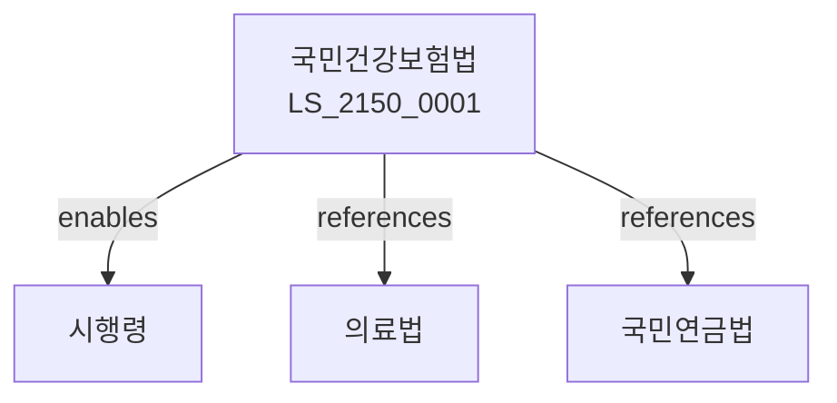

# 국민건강보험법

> [법률 제20210호, 2024. 1. 9., 일부개정]

---

---

## 제1장 총칙
### 제1조 (목적)
이 법은 국민의 질병ㆍ부상 등에 대한 예방ㆍ진단 및 치료에 관하여 보험급여를 실시함으로써 국민의 건강을 보호하고 증진함을 목적으로 한다。

### 제2조 (정의)
이 법에서 사용하는 용어의 뜻은 다음과 같다。
1. "건강보험"란 국민건강보험을 말한다。
2. "가입자"란 건강보험에 가입한 자를 말한다。
3. "피부양자"란 가입자의 부양가족을 말한다。
4. "보험급여"란 보험급여를 말한다。

---

## 제2장 건강보험가입
### 第5条(가입의무)
국민은 건강보험에 가입하여야 한다。
### 第6条(가입자)
가입자를 정한다。
### 第7条(피부양자)
피부양자를 정한다。
### 第8条(자격상실)
자격을 상실한다。

---

## 제3장 건강보험료
### 第15条(보험료)
건강보험료를 납부하여야 한다。
### 第16条(산정기준)
산정기준을 정한다。
### 第17条(부과)
보험료를 부과한다。
### 第18条(징수)
보험료를 징수한다。

---

## 제4장 보험급여
### 第25条(보험급여)
보험급여를 받을 수 있다。
### 第26条(요양급여)
요양급여를 받을 수 있다。
### 第27条(요양비)
요양비를 지급한다。
### 第28条(본인부담금)
본인부담금을 부담한다。

---

## 제5장 건강검진
### 第35条(건강검진)
건강검진을 받을 수 있다。
### 第36条(일반검진)
일반건강검진을 실시한다。
### 第37条(종합검진)
종합건강검진을 실시한다。
### 第38条(검진비용)
검진비용을 부담한다。

---

## 제6장 국민건강보험공단
### 第42条(공단)
국민건강보험공단을 설치한다。
### 第43条(업무)
공단의 업무를 정한다。
### 第44条(운영)
공단을 운영한다。
### 第45条(재정)
공단의 재정을 관리한다。

---

## 제7장 감독
### 第52条(감독)
보건복지부장관은 건강보험사업을 감독한다。
### 第53条(보고 및 검사)
필요한 경우 보고를 명하거나 검사할 수 있다。
### 第54条(시정명령)
위법한 사항에 대하여는 시정을 명할 수 있다。
### 第55条(과징금)
위반사항에 대하여 과징금을 부과할 수 있다。

---

## 제8장 벌칙
### 第62条(벌칙)
다음 각 호의 어느 하나에 해당하는 자는 3년 이하의 징역 또는 3천만원 이하의 벌금에 처한다。

1. 보험료를 납부하지 아니한 자
2. 허위로 급여를 받은 자
### 第63条(과태료)
다음 각 호의 어느 하나에 해당하는 자에게는 2천만원 이하의 과태료를 부과한다。

1. 보고를 하지 아니한 자
2. 검사를 거부한 자

---

## 관계 그래프

**상위 법령**
- [[헌법]] 제36조 (국민의 건강)
- [[사회보장기본법]]

**관련 법령**
- [[의료법]]
- [[국민연금법]]
- [[고용보험법]]
- [[산업재해보상보험법]]

**하위 법령**
- [[국민건강보험법 시행령]]
