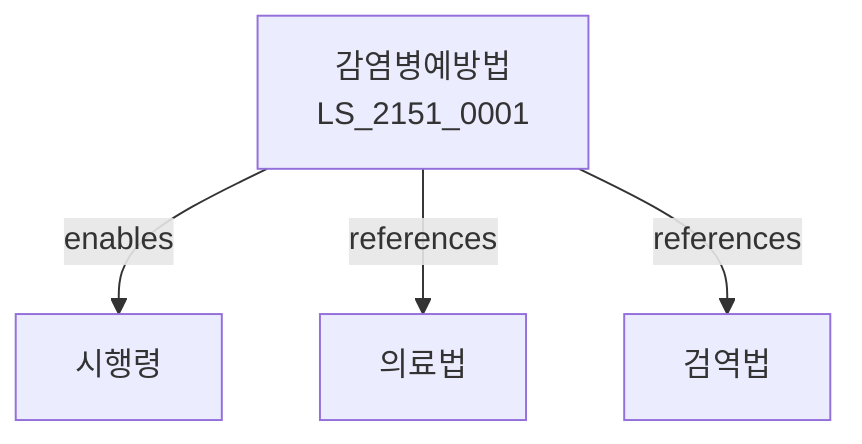

# 감염병예방법

> [법률 제20211호, 2024. 1. 9., 일부개정]

---

---

## 제1장 총칙
### 제1조 (목적)
이 법은 감염병의 예방 및 관리에 관한 사항을 정함으로써 국민의 건강을 보호하고 공중위생을 향상함을 목적으로 한다。

### 제2조 (정의)
이 법에서 사용하는 용어의 뜻은 다음과 같다。
1. "감염병"란 전염성 질병을 말한다。
2. "제1군감염병"란 전염력이 강한 감염병을 말한다。
3. "제2군감염병"란 예방접종이 필요한 감염병을 말한다。
4. "제3군감염병"란 감시가 필요한 감염병을 말한다。

---

## 제2장 감염병예방
### 第5条(예방)
감염병을 예방한다。
### 第6条(예방접종)
예방접종을 실시한다。
### 第7条(국가예방접종)
국가예방접종을 실시한다。
### 第8条(예방접종증명)
예방접종증명을 발급한다。

---

## 제3장 감염병관리
### 第15条(환자관리)
환자를 관리한다。
### 第16条(신고)
감염병을 신고하여야 한다。
### 第17条(역학조사)
역학조사를 실시한다。
### 第18条(격리)
격리할 수 있다。

---

## 제4장 감염병위기
### 第25条(위기관리)
감염병위기를 관리한다。
### 第26条(위기경보)
위기경보를 발령한다。
### 第27条(대응)
위기대응을 한다。
### 第28条(비상사태)
비상사태를 선포할 수 있다。

---

## 제5장 백신
### 第35条(백신)
백신을 확보한다。
### 第36条(백신개발)
백신을 개발한다。
### 第37条(백신생산)
백신을 생산한다。
### 第38条(백신공급)
백신을 공급한다。

---

## 제6장 감독
### 第42条(감독)
보건복지부장관은 감염병예방사업을 감독한다。
### 第43条(보고 및 검사)
필요한 경우 보고를 명하거나 검사할 수 있다。
### 第44条(시정명령)
위법한 사항에 대하여는 시정을 명할 수 있다。
### 第45条(조치)
필요한 조치를 할 수 있다。

---

## 제7장 벌칙
### 第52条(벌칙)
다음 각 호의 어느 하나에 해당하는 자는 3년 이하의 징역 또는 3천만원 이하의 벌금에 처한다。

1. 격리를 위반한 자
2. 허위로 신고한 자
### 第53条(과태료)
다음 각 호의 어느 하나에 해당하는 자에게는 2천만원 이하의 과태료를 부과한다。

1. 신고를 하지 아니한 자
2. 검사를 거부한 자

---

## 관계 그래프

**상위 법령**
- [[헌법]] 제36조 (국민의 건강)
- [[의료법]]

**관련 법령**
- [[검역법]]
- [[국민건강보험법]]
- [[응급의료법]]
- [[방역법]]

**하위 법령**
- [[감염병예방법 시행령]]
